# LogicLab — Codebase API Flow & Distributed Architecture Documentation

> **Document Version**: 2.0.0  
> **Target System**: LogicLab Coding Platform & Developer Social Feed  
> **Analysis Engine**: Deep Codebase Reverse-Engineering & AST Inspection  
> **Source Roots Verified**:
> - Primary API Server (`Day01/src`)
> - Notification Microservice (`NotificationService/src`)
> - Frontend Single Page Application (`Day02/vite-project/src`)

---

## 1. Global System Architecture

LogicLab is an online coding judge and developer social network built using a decoupled distributed architecture:

1. **Client Tier (`Day02/vite-project`)**: React 19 SPA powered by Vite, Redux Toolkit (`authSlice`), React Router v7, Monaco Editor, TailwindCSS v4, DaisyUI, and Server-Sent Events (SSE) subscribers.
2. **Primary Application Monolith (`Day01`)**: Node.js/Express 5 server on port 3000 handling user management, problem curation, test-running, Bull queue job ingestion, Gemini AI DSA tutoring, and feed Kafka event production.
3. **Notification Microservice (`NotificationService`)**: Independent Node.js/Express 5 server on port 3001 acting as a dedicated Kafka consumer (`notification-processing-group`) and real-time Server-Sent Events (SSE) streaming gateway.
4. **Data & Storage Infrastructure**:
   - **MongoDB**: Primary persistent document store for users, problems, submissions, posts, comments, and notifications.
   - **Redis**: Multi-purpose memory engine serving as Bull task queue storage, cache layer for problems and public profiles, distributed token revocation blocklist, atomic rate limiting, atomic post/comment voting (via Lua), and real-time Pub/Sub broker for submission execution events.
   - **Apache Kafka**: High-throughput distributed event log (`feed-events` topic) decoupling post, comment, and vote persistence from real-time social notification delivery across independent consumer groups.
   - **Judge0 CE API**: Sandboxed remote code execution engine wrapped with a custom 3-state circuit breaker (`CLOSED` -> `OPEN` -> `HALF_OPEN`).
   - **Google Gemini AI**: GenAI SDK (`@google/genai`) running `gemini-flash-latest` wrapped in circuit breaker protection for contextual DSA debugging and tutoring.
   - **Cloudinary**: Cloud image storage for user profile avatars and feed post media attachments.

```mermaid
flowchart TB
    subgraph ClientTier ["Frontend Client (React 19 / Vite / Redux / Monaco)"]
        UI_Home["Homepage / Problem List"]
        UI_Editor["Problem Page (Monaco Editor)"]
        UI_Feed["FeedLab (Social Feed)"]
        UI_Notify["Notification Center & Floating Toast"]
    end

    subgraph PrimaryBackend ["Primary API Server (Day01 : Port 3000)"]
        Exp_User["/user Auth & Profile Router"]
        Exp_Problem["/problem CRUD Router"]
        Exp_Submit["/submission Router"]
        Exp_AI["/ai Chat Router"]
        Exp_Feed["/post & /comment Routers"]
        Exp_GQL["/graphql Root Query"]
        
        CB_Judge["CircuitBreaker (Judge0)"]
        CB_Gemini["CircuitBreaker (GeminiAI)"]
        
        Kafka_Prod["Kafka Producer (feed-events)"]
        Feed_Worker["Kafka Consumer (feed-processing-group)"]
        Bull_Queue["Bull Queue Producer ('submissions')"]
        Bull_Worker["Bull Queue Worker (Concurrency: 5)"]
    end

    subgraph NotificationTier ["Notification Microservice (NotificationService : Port 3001)"]
        Exp_Notif["/api/notifications REST Router"]
        SSE_Stream["/api/notifications/stream (SSE Gateway)"]
        Notif_Worker["Kafka Consumer (notification-processing-group)"]
        SSE_Registry[("In-Memory SSE Registry: Map<userId, Set<Res>>")]
    end

    subgraph InfraTier ["Distributed Infrastructure & External APIs"]
        DB[(MongoDB)]
        REDIS[(Redis 7)]
        KAFKA{{"Apache Kafka ('feed-events')"}}
        JUDGE0[["External Judge0 CE API"]]
        GEMINI[["Google Gemini AI API"]]
        CLOUDINARY[["Cloudinary Media Storage"]]
    end

    %% Client to Primary Backend
    UI_Home -->|REST HTTP| Exp_User
    UI_Home -->|REST HTTP| Exp_Problem
    UI_Editor -->|POST /submission/run| Exp_Submit
    UI_Editor -->|POST /submission/submit| Exp_Submit
    UI_Editor -->|GET /submission/status (Polling Fallback)| Exp_Submit
    UI_Editor -->|GET /submission/stream (SSE Push)| Exp_Submit
    UI_Editor -->|POST /ai/chat| Exp_AI
    UI_Feed -->|REST HTTP| Exp_Feed
    UI_Feed -->|POST GraphQL| Exp_GQL

    %% Client to Notification Backend
    UI_Notify -->|GET /api/notifications REST| Exp_Notif
    UI_Notify -->|SSE Stream Connection| SSE_Stream

    %% Primary Backend Internal & External Integrations
    Exp_User --> DB
    Exp_User --> REDIS
    Exp_User --> CLOUDINARY
    
    Exp_Problem --> DB
    Exp_Problem --> REDIS
    Exp_Problem --> CB_Judge
    CB_Judge --> JUDGE0
    
    Exp_AI --> CB_Gemini
    CB_Gemini --> GEMINI
    
    Exp_Submit --> REDIS
    Exp_Submit --> Bull_Queue
    Bull_Queue --> REDIS
    REDIS --> Bull_Worker
    Bull_Worker --> CB_Judge
    Bull_Worker --> DB
    Bull_Worker -->|Pub/Sub Push| REDIS
    REDIS -.->|Pub/Sub Trigger| Exp_Submit

    Exp_Feed --> REDIS
    Exp_Feed --> CLOUDINARY
    Exp_Feed --> Kafka_Prod
    Kafka_Prod --> KAFKA

    KAFKA --> Feed_Worker
    Feed_Worker --> DB
    Feed_Worker --> REDIS

    %% Notification Service Integrations
    KAFKA --> Notif_Worker
    Notif_Worker --> DB
    Notif_Worker --> SSE_Registry
    SSE_Registry --> SSE_Stream
    Exp_Notif --> DB
```

---

## 2. Complete API Inventory

| # | Method | Endpoint | Service / Port | Frontend Caller | Controller Function | Database Operations | Redis Operations | Queue / Worker | Kafka | External Integrations |
|---|--------|----------|----------------|-----------------|---------------------|---------------------|------------------|----------------|-------|-----------------------|
| 1 | `POST` | `/user/register` | Day01 : 3000 | `SignUp.jsx` -> `registerUser()` | `register()` | `User.exists`, `User.create` | — | — | — | Bcrypt, JWT |
| 2 | `POST` | `/user/admin/register` | Day01 : 3000 | Administrative Tooling | `adminRegister()` | `User.exists`, `User.create` | `redisclient.exists` (token blocklist check) | — | — | Bcrypt, JWT |
| 3 | `POST` | `/user/login` | Day01 : 3000 | `Login.jsx` -> `loginUser()` | `login()` | `User.findOne` | Lua script `executeAtomicRateLimit` | — | — | Bcrypt, JWT |
| 4 | `POST` | `/user/logout` | Day01 : 3000 | `Homepage.jsx` -> `logoutUser()` | `logout()` | `User.findById` | `SET token:..., EXPIREAT` | — | — | JWT |
| 5 | `DELETE`| `/user/profile` | Day01 : 3000 | Direct Client Call | `deleteProfile()` | `User.findByIdAndDelete` -> cascade post hook `Submission.deleteMany` | `redisclient.exists` | — | — | — |
| 6 | `GET` | `/user/check` | Day01 : 3000 | `App.jsx` -> `checkAuth()` | Inline handler `(req, res)` | `User.findById` | `redisclient.exists` | — | — | JWT |
| 7 | `GET` | `/user/getprofile` | Day01 : 3000 | `Homepage.jsx`, `Admininfo.jsx`, `UpdateProfile.jsx` | `getprofile()` | `User.findById.populate('problemSolved')` | `redisclient.exists` | — | — | — |
| 8 | `GET` | `/user/profile/:id` | Day01 : 3000 | `Profile.jsx` | `getPublicProfile()` | `User.findById.populate('problemSolved')` | Cache `GET profile:public:${id}`, `SETEX 3600s` | — | — | — |
| 9 | `PUT` | `/user/profile` | Day01 : 3000 | `UpdateProfile.jsx` -> `onSubmit()` | `updateProfile()` | `User.findByIdAndUpdate` | `DEL profile:public:${userId}` | — | — | Multer, Cloudinary (`logiclab_avatars`) |
| 10 | `POST` | `/problem/create` | Day01 : 3000 | `CreateProblem.jsx` -> `handleSubmit()` | `problemCreate()` | `Problem.create` | `SCAN` cursor loop + `DEL problems:*` | — | — | Judge0 batch validation via circuit breaker |
| 11 | `PUT` | `/problem/update/:id` | Day01 : 3000 | `UpdateProblem.jsx` -> `onSubmit()` | `problemUpdate()` | `Problem.findById`, `Problem.findByIdAndUpdate` | `SCAN` cursor loop + `DEL problems:*`, `DEL problem:${id}` | — | — | Judge0 batch validation via circuit breaker |
| 12 | `DELETE`| `/problem/delete/:id` | Day01 : 3000 | `DeleteProblem.jsx` -> `handleDelete()` | `problemDelete()` | `Problem.findById`, `Problem.findByIdAndDelete` | `SCAN` cursor loop + `DEL problems:*`, `DEL problem:${id}` | — | — | — |
| 13 | `GET` | `/problem/ProblemById/:id` | Day01 : 3000 | `Problempage.jsx`, `UpdateProblem.jsx` | `problemFetch()` | `Problem.findById.select` | Cache `GET problem:${id}`, `SETEX 3600s` | — | — | — |
| 14 | `GET` | `/problem/getAllProblem/` | Day01 : 3000 | `Homepage.jsx`, `Allproblems.jsx`, `DeleteProblem.jsx` | `problemFetchAll()` | `Problem.countDocuments`, `Problem.find.skip.limit` | Cache `GET problems:page=...`, `SETEX 300s` | — | — | — |
| 15 | `GET` | `/problem/problemSolvedByUser/user` | Day01 : 3000 | `Homepage.jsx` -> `fetchSolvedProblems()` | `solvedProblem()` | `User.findById.populate('problemSolved')` | `redisclient.exists` | — | — | — |
| 16 | `GET` | `/problem/submittedProblem/:pid` | Day01 : 3000 | `SubmissionHistory.jsx` | `submittedProblem()` | `Submission.find({userId, problemId}).sort` | `redisclient.exists` | — | — | — |
| 17 | `GET` | `/problem/submission/:id` | Day01 : 3000 | `SubmissionDetail.jsx` | `getSubmissionById()` | `Submission.findById.populate('problemId')` | `redisclient.exists` | — | — | — |
| 18 | `GET` | `/problem/lastSubmission/:pid` | Day01 : 3000 | `Problempage.jsx` | `getLastSuccessfulSubmission()` | `Submission.findOne({status: 'accepted'}).sort` | `redisclient.exists` | — | — | — |
| 19 | `POST` | `/submission/submit/:id` | Day01 : 3000 | `Problempage.jsx` -> `handleSubmitCode()` | `submitCode()` | Read in worker: `Problem.findById`, Write in worker: `Submission.create`, `User.updateOne($addToSet)` | `HGETALL/HSET submission:meta:${key}`, `GET submission:result:${key}`, Rate limit Lua | Bull Queue `submissions.add()` -> `submissionQueue.process(5)` | — | Judge0 batch run in Bull worker |
| 20 | `GET` | `/submission/status/:idempotencyKey` | Day01 : 3000 | `Problempage.jsx` (2s Polling interval) | `checkSubmissionStatus()` | — | `GET submission:result:${key}`, `HGETALL submission:meta:${key}` | Bull job tracking | — | — |
| 21 | `GET` | `/submission/stream/:idempotencyKey` | Day01 : 3000 | Browser EventSource / Client Stream | `streamSubmissionStatus()` | — | Redis Pub/Sub `SUBSCRIBE submission:stream:${key}` | Bull job completion trigger | — | — |
| 22 | `POST` | `/submission/run/:id` | Day01 : 3000 | `Problempage.jsx` -> `handleRun()` | `runCode()` | `Problem.findById` | Rate limit Lua script | — | — | Synchronous Judge0 batch execution via Circuit Breaker |
| 23 | `POST` | `/ai/chat` | Day01 : 3000 | `ChatAi.jsx` -> `onSubmit()` | `aiChat()` | — | `redisclient.exists` | — | — | Google Gemini AI (`@google/genai`) |
| 24 | `GET` | `/post/` | Day01 : 3000 | `FeedLab.jsx` (Infinite Scroll) | `getAllPosts()` | `Post.find.populate.skip.limit`, `Post.countDocuments`, `Comment.countDocuments` | `redisclient.exists` | — | — | — |
| 25 | `GET` | `/post/user/:userId` | Day01 : 3000 | `Profile.jsx` | `getPostsByUser()` | `Post.find({author}).populate.sort`, `Comment.countDocuments` | `redisclient.exists` | — | — | — |
| 26 | `GET` | `/post/user/:userId/bookmarked` | Day01 : 3000 | `Profile.jsx`, `FeedLab.jsx` | `getBookmarkPostsByUser()` | `User.findById.populate('bookmarkPosts')`, `Comment.countDocuments` | `redisclient.exists` | — | — | — |
| 27 | `POST` | `/post/create` | Day01 : 3000 | `FeedLab.jsx` -> `handlePostSubmit()` | `createPost()` | Write in worker: `Post.create` | Rate limit Lua script | — | Producer sends `POST_CREATED` to `feed-events` | Cloudinary (`logiclab_posts`) |
| 28 | `DELETE`| `/post/:id` | Day01 : 3000 | `FeedLab.jsx` -> `handleDeletePost()` | `deletePost()` | `Post.findById`, `Comment.deleteMany`, `Post.deleteOne` | `DEL post:${id}:score` | — | — | Cloudinary `destroy` |
| 29 | `POST` | `/post/upvote/:id` | Day01 : 3000 | `FeedLab.jsx` -> `handleVote()` | `upvotePost()` | `Post.findById`, Write in worker: `Post.updateOne($addToSet/$pull, $inc)` | Lua script `executeAtomicVote` (`SETEX`, `INCRBY`) | — | Producer sends `UPVOTE` to `feed-events` | — |
| 30 | `POST` | `/post/downvote/:id` | Day01 : 3000 | `FeedLab.jsx` -> `handleVote()` | `downvotePost()` | `Post.findById`, Write in worker: `Post.updateOne` | Lua script `executeAtomicVote` | — | Producer sends `DOWNVOTE` to `feed-events` | — |
| 31 | `POST` | `/post/bookmark/:id` | Day01 : 3000 | `FeedLab.jsx` -> `handleToggleBookmark()` | `toggleBookmarkPost()` | `Post.findById`, `User.findById`, `User.updateOne($pull / $addToSet)` | `redisclient.exists` | — | — | — |
| 32 | `POST` | `/comment/:postId` | Day01 : 3000 | `CommentSection.jsx` -> `handleSubmit()` | `createComment()` | `Post.findById`, `Comment.findById`, Write in worker: `Comment.create` | Rate limit Lua script | — | Producer sends `COMMENT` to `feed-events` | — |
| 33 | `DELETE`| `/comment/:commentId` | Day01 : 3000 | `CommentSection.jsx` -> `handleDelete()` | `deleteComment()` | `Comment.findById`, `Comment.deleteMany` (cascade replies) | `DEL comment:${commentId}:score` | — | — | — |
| 34 | `POST` | `/comment/upvote/:commentId` | Day01 : 3000 | `CommentSection.jsx` -> `handleUpvote()` | `upvoteComment()` | `Comment.findById`, Write in worker: `Comment.updateOne` | Lua script `executeAtomicVote` | — | Producer sends `UPVOTE_COMMENT` to `feed-events` | — |
| 35 | `POST` | `/graphql` | Day01 : 3000 | `CommentSection.jsx` -> `fetchComments()` | `commentSchema.js` RootQuery resolver | `Comment.find({post}).sort`, `User.findById` (per comment author) | — | — | — | GraphQL HTTP |
| 36 | `GET` | `/health` | Day01 : 3000 | Health monitors / Load balancers | Inline handler `(req, res)` | — | — | — | — | Node.js process |
| 37 | `GET` | `/health` | Notification : 3001 | Health monitors / Orchestrators | Inline handler `(req, res)` | — | — | — | — | Node.js process |
| 38 | `GET` | `/api/notifications/stream` | Notification : 3001 | `NotificationContext.jsx` -> `connectSSE()` | `streamNotifications()` | — | — | — | — | SSE Gateway (`text/event-stream`) |
| 39 | `GET` | `/api/notifications/` | Notification : 3001 | `NotificationContext.jsx` -> `fetchNotifications()` | `getNotifications()` | `Notification.find.sort.skip.limit`, `Notification.countDocuments` | — | — | — | — |
| 40 | `PATCH`| `/api/notifications/read-all` | Notification : 3001 | `NotificationContext.jsx` -> `markAllAsRead()` | `markAllAsRead()` | `Notification.updateMany({isRead: false})` | — | — | — | — |
| 41 | `PATCH`| `/api/notifications/:id/read` | Notification : 3001 | `NotificationContext.jsx` -> `markAsRead()` | `markAsRead()` | `Notification.findOneAndUpdate({isRead: true})` | — | — | — | — |
| 42 | `DELETE`| `/api/notifications/:id` | Notification : 3001 | `NotificationContext.jsx` -> `deleteNotification()` | `deleteNotification()` | `Notification.findOneAndDelete` | — | — | — | — |

---

## 3. Detailed Trace for Every Discovered API

---

### API 1: `POST /user/register`

#### Purpose
Validates new user registration credentials, verifies email uniqueness in MongoDB, hashes the password using bcrypt, creates the user document, generates a JWT token, sets a signed HTTP-only cookie, and logs the user in.

#### Frontend Entry Point
- Component: `SignUp.jsx`
- Trigger: Form submission handler `onSubmit(userData)`
- Dispatches: Redux Thunk `registerUser(userData)` located in `Day02/vite-project/src/authSlice.js`
- HTTP Client: `axiosClient.post("/user/register", userData)` via `Day02/vite-project/src/utility/axios.js`

#### Request Flow
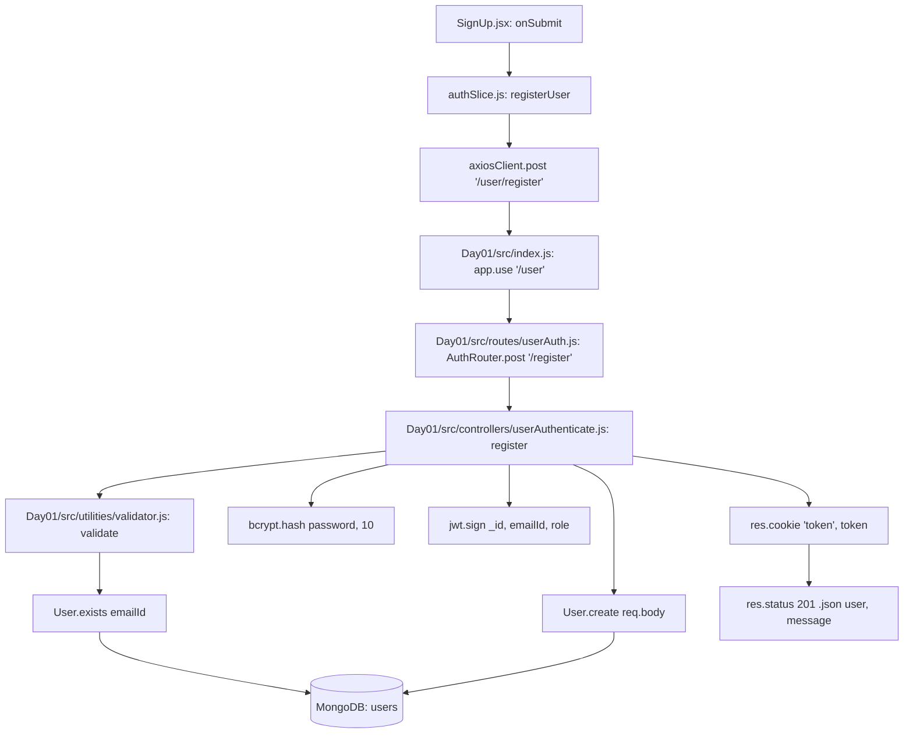

#### Complete Function Trace
1. `SignUp.jsx` -> `onSubmit(data)`
2. `authSlice.js` -> `dispatch(registerUser(userData))`
3. `axiosClient.interceptors.request` -> `nprogress.start()`
4. `Day01/src/index.js` -> `app.use("/user", AuthRouter)`
5. `Day01/src/routes/userAuth.js` -> `AuthRouter.post("/register", register)`
6. `Day01/src/controllers/userAuthenticate.js` -> `register(req, res)`
7. `Day01/src/utilities/validator.js` -> `validate(req.body)`
8. `Day01/src/models/user.js` -> `User.exists({ emailId })`
9. `bcrypt.hash(password, 10)`
10. `Day01/src/models/user.js` -> `User.create(req.body)`
11. `jwt.sign({ _id, emailId, role: "user" }, JWT_KEY, { expiresIn: 7200 })`
12. `getCookieOptions(req)` calculates cookie flags (`sameSite`, `secure`, `maxAge: 7200000ms`)
13. `res.cookie("token", token, options)`
14. `res.status(201).json({ user: reply, message: "Logged in Successful" })`
15. `axiosClient.interceptors.response` -> `nprogress.done()`
16. `authSlice.js` -> `builder.addCase(registerUser.fulfilled)` updates Redux state (`user`, `isAuthenticated: true`)

#### Request Data
```json
{
  "firstName": "John",
  "lastName": "Doe",
  "emailId": "john@example.com",
  "password": "StrongPassword@123"
}
```

#### Data Transformation
`req.body.password` is plaintext -> hashed via `bcrypt.hash(..., 10)`. Role is forced to `"user"`. Returned payload strips the password and returns only safe profile attributes (`_id`, `firstName`, `lastName`, `nickname`, `emailId`, `role`, `profilePicture`).

#### Database Operations
- Read: `User.exists({ emailId })` on collection `users`.
- Write: `User.create(req.body)` inserting 1 document into `users`.

#### Redis / Queue / Kafka / Judge0 / AI
Not involved (`—`).

#### Response
- Status: `201 Created`
- Body:
```json
{
  "user": {
    "firstName": "John",
    "lastName": "Doe",
    "nickname": "",
    "emailId": "john@example.com",
    "_id": "670ab34e...",
    "role": "user",
    "profilePicture": null
  },
  "message": "Logged in Successful"
}
```

#### Error Paths
- Validator throws (`"Some Field missing"`, `"Invalid Email"`, `"Weak Password"`, `"Invalid firstName"`): caught, returns `400 Bad Request` with `"Error " + err.message`.
- Existing Email: caught by pre-check (`"Email already exists"`) or Mongo unique index violation (`err.code === 11000`), returns `400 Bad Request`.

#### Files Involved
- `Day02/vite-project/src/pages/SignUp.jsx`
- `Day02/vite-project/src/authSlice.js`
- `Day02/vite-project/src/utility/axios.js`
- `Day01/src/routes/userAuth.js`
- `Day01/src/controllers/userAuthenticate.js`
- `Day01/src/utilities/validator.js`
- `Day01/src/models/user.js`

---

### API 2: `POST /user/admin/register`

#### Purpose
Administrative endpoint to register a new user account with elevated permissions. Enforces authentication and admin role validation via `adminMiddleware`.

#### Frontend Entry Point
- Internal admin provisioning scripts or direct API client.

#### Request Flow
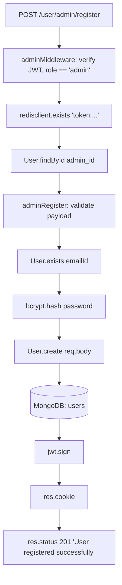

#### Complete Function Trace
1. `Day01/src/routes/userAuth.js` receives request -> `AuthRouter.post("/admin/register", adminMiddleware, adminRegister)`
2. `Day01/src/middleware/adminMiddleware.js` extracts `req.cookies.token`
3. `jwt.verify(token, JWT_KEY)` verifies signature and decodes payload
4. Inspects `payload.role !== "admin"` -> throws 401 if not admin
5. `Day01/src/models/user.js` -> `User.findById(_id)`
6. `Day01/src/config/redis.js` -> `redisclient.exists("token:" + token)` verifies token is not blocklisted
7. `Day01/src/controllers/userAuthenticate.js` -> `adminRegister(req, res)`
8. `validate(req.body)`
9. `User.exists({ emailId })`
10. `bcrypt.hash(password, 10)`
11. `User.create(req.body)`
12. `jwt.sign(...)`
13. `res.cookie(...)`
14. `res.status(201).send("User registered successfully")`

#### Database Operations
- Read: `User.findById(_id)` (auth check), `User.exists({ emailId })`.
- Write: `User.create(req.body)`.

#### Redis Operations
- `EXISTS token:${token}` checks blocklist.

#### Error Paths
- Missing or invalid cookie: returns `401 Unauthorized` (`"Error Invalid token"`).
- Role is not `"admin"`: returns `401 Unauthorized` (`"Error Invalid token"`).
- Blocklisted token in Redis: returns `401 Unauthorized` (`"Error Invalid Token"`).
- Duplicate email: returns `400 Bad Request` (`"Email already exists"`).

---

### API 3: `POST /user/login`

#### Purpose
Authenticates registered users via email and password, executes atomic rate limiting (max 25 attempts per 60 seconds), verifies hashed password with bcrypt, and sets a 2-hour HTTP-only session cookie.

#### Frontend Entry Point
- Component: `Day02/vite-project/src/pages/Login.jsx`
- Trigger: `onSubmit(credentials)`
- Dispatches: Redux Thunk `loginUser(credentials)` in `Day02/vite-project/src/authSlice.js`
- HTTP Client: `axiosClient.post("/user/login", credentials)`

#### Request Flow
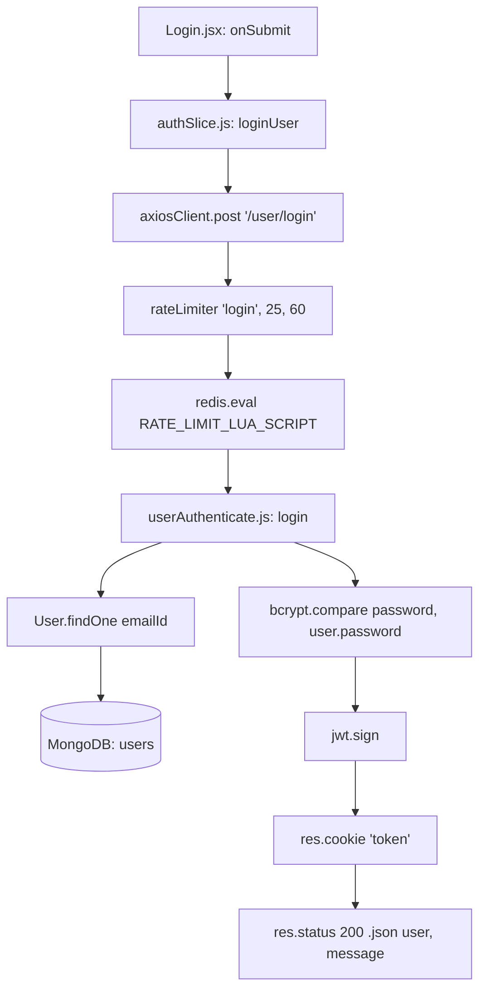

#### Complete Function Trace
1. `Login.jsx` -> `onSubmit(data)`
2. `authSlice.js` -> `dispatch(loginUser(credentials))`
3. `Day01/src/middleware/rateLimiter.js` -> `rateLimiter("login", 25, 60)`
4. `Day01/src/config/redis.js` -> `executeAtomicRateLimit({ key: "ratelimit:login:${emailId}", limit: 25, windowSeconds: 60 })`
   - Executes `RATE_LIMIT_LUA_SCRIPT` via `redisclient.eval`
   - Sets headers `X-RateLimit-Limit: 25`, `X-RateLimit-Remaining: N`
5. `Day01/src/controllers/userAuthenticate.js` -> `login(req, res)`
6. `User.findOne({ emailId })`
7. `bcrypt.compare(password, user.password)`
8. Constructs `reply` user object
9. `jwt.sign({ _id: user._id, emailId: user.emailId, role: user.role }, JWT_KEY, { expiresIn: 7200 })`
10. `res.cookie("token", token, getCookieOptions(req))`
11. `res.status(200).json({ user: reply, message: "Logged in Successful" })`

#### Redis Operations
- `EVAL RATE_LIMIT_LUA_SCRIPT` -> executes `INCR ratelimit:login:${emailId}`, conditionally runs `EXPIRE ... 60`.

#### Error Paths
- Rate limit exceeded: returns `429 Too Many Requests` with header `Retry-After: <ttl>` and JSON `{ message, retryAfter }`.
- Redis transient failure: fail-open design allows request to proceed.
- User not found or bcrypt password mismatch: returns `401 Unauthorized` with text `"Error Invalid Credentials"`.

---

### API 4: `POST /user/logout`

#### Purpose
Logs out an authenticated user by taking the active JWT token from cookies, adding it to the Redis revocation blocklist with a TTL matching its remaining expiration time (`EXPIREAT`), and clearing the cookie.

#### Frontend Entry Point
- Component: `Day02/vite-project/src/pages/Homepage.jsx` (`handleLogout`)
- Dispatches: Redux Thunk `logoutUser()` in `authSlice.js`
- HTTP Client: `axiosClient.post("/user/logout")`

#### Request Flow
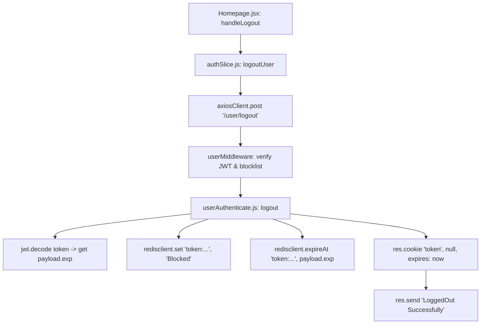

#### Redis Operations
- `SET token:${token} "Blocked"`
- `EXPIREAT token:${token} ${payload.exp}`

#### Error Paths
- Missing token / invalid token: `userMiddleware` catches, returns `401 Unauthorized`.
- Redis command failure: returns `503 Service Unavailable` with `"Error " + err.message`.

---

### API 5: `DELETE /user/profile`

#### Purpose
Deletes the authenticated user's account from MongoDB. Triggers a Mongoose `post('findOneAndDelete')` cascade hook that deletes all submissions created by this user.

#### Frontend Entry Point
- Profile management settings interface.

#### Complete Function Trace
1. `userMiddleware` authenticates `req.cookies.token`.
2. `deleteProfile(req, res)` extracts `userId = req.result._id`.
3. `User.findByIdAndDelete(userId)`.
4. Mongoose post-hook in `Day01/src/models/user.js`:
   ```javascript
   userSchema.post("findOneAndDelete", async function (userInfo) {
     if (userInfo) {
       await mongoose.model("submission").deleteMany({ userId: userInfo._id });
     }
   });
   ```
5. `res.status(200).send("Deleted Successfully")`.

#### Database Operations
- Collection `users`: `findByIdAndDelete(userId)`
- Collection `submissions`: `deleteMany({ userId })` (triggered by cascade post-hook).

---

### API 6: `GET /user/check`

#### Purpose
Session validation endpoint called upon client app boot. Returns the currently authenticated user's sanitized identity profile if their JWT token and cookie are valid and not on the Redis blocklist.

#### Frontend Entry Point
- Component: `Day02/vite-project/src/App.jsx`
- Trigger: `useEffect(() => { dispatch(checkAuth()); }, [dispatch])`
- Action: `authSlice.js: checkAuth()` -> `axiosClient.get("/user/check")`

#### Complete Function Trace
1. `App.jsx` loads -> dispatches `checkAuth()`.
2. `Day01/src/routes/userAuth.js` route: `AuthRouter.get("/check", userMiddleware, handler)`.
3. `userMiddleware` executes:
   - Validates `req.cookies.token` with `jwt.verify`.
   - Fetches `User.findById(_id)`.
   - Checks `redisclient.exists("token:" + token)`.
   - Attaches `req.result = result`.
4. Route handler constructs response object (`firstName`, `lastName`, `nickname`, `emailId`, `_id`, `role`, `profilePicture`).
5. `res.status(200).json({ user: reply, message: "Valid User" })`.

---

### API 7: `GET /user/getprofile`

#### Purpose
Retrieves full profile details for the authenticated user, populating their list of solved problems (`problemSolved`) with problem titles and difficulty ratings.

#### Frontend Entry Point
- Components: `Homepage.jsx` (`fetchProfilePicture`), `Admininfo.jsx`, `UpdateProfile.jsx`
- HTTP Client: `axiosClient.get("/user/getprofile")`

#### Complete Function Trace
1. `userMiddleware` validates user session.
2. `Day01/src/controllers/userAuthenticate.js` -> `getprofile(req, res)`.
3. `User.findById(req.result._id).populate("problemSolved", "title difficulty")`.
4. Returns extended profile fields including `age`, `gender`, `location`, `birthday`, `websites`, `github`, `linkedin`, `work`, `education`, `skills`, and `problemSolved`.

---

### API 8: `GET /user/profile/:id`

#### Purpose
Fetches a user's public profile by their user ID. Implements read-through caching in Redis with a 3600-second (1-hour) TTL under key `profile:public:${id}`.

#### Frontend Entry Point
- Component: `Day02/vite-project/src/pages/Profile.jsx`
- HTTP Client: `axiosClient.get("/user/profile/" + targetId)`

#### Request Flow
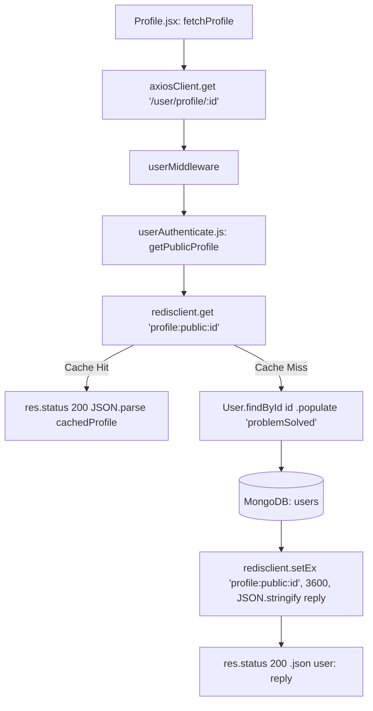

#### Redis Operations
- `GET profile:public:${id}`
- `SETEX profile:public:${id} 3600 ${JSON.stringify(reply)}` (on cache miss).

---

### API 9: `PUT /user/profile`

#### Purpose
Updates profile fields for the authenticated user. Handles optional profile picture upload via `multer` and streams the image buffer to Cloudinary (`logiclab_avatars` folder). Invalidates the Redis public profile cache.

#### Frontend Entry Point
- Component: `Day02/vite-project/src/pages/UpdateProfile.jsx`
- Handler: `onSubmit(data)`
- HTTP Client: `axiosClient.put("/user/profile", formData, { headers: { "Content-Type": "multipart/form-data" } })`

#### Complete Function Trace
1. `UpdateProfile.jsx` packages `FormData` with fields, stringified `work`, `education`, comma-separated `skills`, and optional `profilePicture` file.
2. `Day01/src/routes/userAuth.js` passes through `userMiddleware` and `upload.single("profilePicture")`.
   - `upload` is configured in `cloudinaryUpload.js` with memory storage, 5MB limit, and MIME-type filter.
3. `Day01/src/controllers/userAuthenticate.js` -> `updateProfile(req, res)`.
4. Parses fields (`skills`, `work`, `education`).
5. If `req.file` exists:
   - Calls `uploadToCloudinary(req.file.buffer, "logiclab_avatars")`.
   - Streamifier pipes memory buffer into Cloudinary upload stream with face cropping (`crop: 'fill', gravity: 'face', width: 300, height: 300`).
   - Assigns `updateData.profilePicture = result.secure_url`.
6. `User.findByIdAndUpdate(userId, updateData, { new: true, runValidators: true })`.
7. `redisclient.del("profile:public:" + userId)` invalidates stale cache.
8. `res.status(200).json({ user: updatedUser, message: "Profile updated successfully" })`.

#### External Integrations
- Cloudinary: `cloudinary.uploader.upload_stream` (Folder: `logiclab_avatars`).

---

### API 10: `POST /problem/create`

#### Purpose
Admin endpoint to author a new problem. Before saving, every reference solution provided in `referenceSolution` is submitted to Judge0 against the problem's visible test cases (`visibletestCase`). Only if all reference solutions return `status_id === 3` (Accepted) is the problem persisted to MongoDB. All paginated problem caches in Redis are cleared via non-blocking `SCAN`.

#### Frontend Entry Point
- Component: `Day02/vite-project/src/pages/CreateProblem.jsx`
- Handler: `handleSubmit(data)`
- HTTP Client: `axiosClient.post("/problem/create", data)`

#### Request Flow
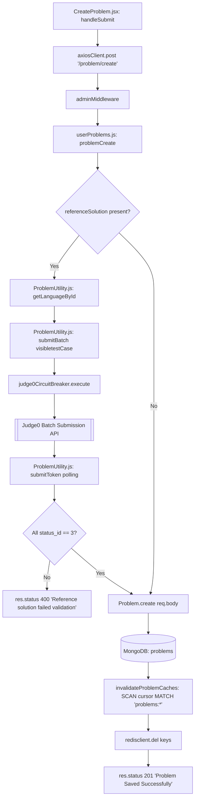

#### Complete Function Trace
1. `CreateProblem.jsx` submits problem payload.
2. `adminMiddleware` validates admin identity and JWT token.
3. `Day01/src/controllers/userProblems.js` -> `problemCreate(req, res)`.
4. Loops over `referenceSolution`:
   - `getLanguageById(language)` maps language names (`c++` -> `54`, `java` -> `62`, `javascript` -> `63`).
   - Maps visible test cases to Judge0 batch items.
   - `submitBatch(submissions)` executes via `judge0CircuitBreaker.execute`.
   - `submitToken(resultToken)` polls Judge0 batch endpoint until `status_id > 2`.
   - Validates `status_id == 3` for every test case.
5. `Problem.create({ ...req.body, problemCreator: req.result._id })`.
6. `invalidateProblemCaches()`:
   - Uses `redisclient.scan(cursor, { MATCH: "problems:*", COUNT: 50 })` in a do-while loop.
   - Calls `redisclient.del(keys)` to clear cached problem list pages without blocking the Redis event loop.
7. `res.status(201).json({ message: "Problem Saved Successfully", problem: userProblem })`.

#### External Integrations
- Judge0 CE: `POST https://judge0-ce.p.rapidapi.com/submissions/batch`, `GET .../submissions/batch?tokens=...`

---

### API 11: `PUT /problem/update/:id`

#### Purpose
Admin endpoint to modify an existing problem. Re-validates reference solutions against visible test cases via Judge0, updates MongoDB, and invalidates both `problems:*` collection caches and the specific `problem:${id}` cache key.

#### Frontend Entry Point
- Component: `Day02/vite-project/src/pages/UpdateProblem.jsx`
- Handler: `onSubmit(data)`
- HTTP Client: `axiosClient.put("/problem/update/" + id, data)`

#### Complete Function Trace
1. `adminMiddleware` verifies admin role.
2. `userProblems.js` -> `problemUpdate(req, res)`.
3. `Problem.findById(id)` verifies problem exists.
4. Executes Judge0 batch submission and polling validation if reference solutions are modified.
5. `Problem.findByIdAndUpdate(id, { ...req.body }, { runValidators: true, new: true })`.
6. `invalidateProblemCaches(id)`: scans and deletes `problems:*`, then `DEL problem:${id}`.
7. `res.status(200).json(newProblem)`.

---

### API 12: `DELETE /problem/delete/:id`

#### Purpose
Admin endpoint to remove a problem. Deletes the problem record from MongoDB and flushes all associated Redis problem caches.

#### Frontend Entry Point
- Component: `Day02/vite-project/src/pages/DeleteProblem.jsx`
- Handler: `handleDelete(id)`
- HTTP Client: `axiosClient.delete("/problem/delete/" + confirmId)`

#### Complete Function Trace
1. `adminMiddleware` validates admin token.
2. `userProblems.js` -> `problemDelete(req, res)`.
3. `Problem.findById(id)` checks existence.
4. `Problem.findByIdAndDelete(id)`.
5. `invalidateProblemCaches(id)` flushes `problems:*` and `problem:${id}` from Redis.
6. `res.status(200).send("Problem Deleted Succesfully")`.

---

### API 13: `GET /problem/ProblemById/:id`

#### Purpose
Fetches problem details for display in the code editor or update panel. Caches the problem payload in Redis with a 3600-second TTL under key `problem:${id}`.

#### Frontend Entry Point
- Components: `Day02/vite-project/src/pages/Problempage.jsx` (`fetchProblem`), `UpdateProblem.jsx`
- HTTP Client: `axiosClient.get("/problem/ProblemById/" + problemId)`

#### Complete Function Trace
1. `userMiddleware` checks user authentication.
2. `problemFetch(req, res)` checks `redisclient.get("problem:" + id)`.
3. If cache hit: returns cached JSON immediately.
4. If cache miss: queries `Problem.findById(id).select("title description difficulty tags visibletestCase _id startCode hiddentestCase referenceSolution startCode")`.
5. `redisclient.setEx("problem:" + id, 3600, JSON.stringify(getproblem))`.
6. `res.status(200).send(getproblem)`.

---

### API 14: `GET /problem/getAllProblem/`

#### Purpose
Provides paginated, filterable, and searchable problem listings. Supports pagination (`page`, `limit`), search query (`search`), difficulty filtering (`difficulty`), and tag filtering (`tag`). Caches page results in Redis for 300 seconds.

#### Frontend Entry Point
- Components: `Homepage.jsx`, `Allproblems.jsx`, `DeleteProblem.jsx`
- HTTP Client: `axiosClient.get("/problem/getAllProblem?page=...&limit=...&search=...&difficulty=...&tag=...")`

#### Request Flow
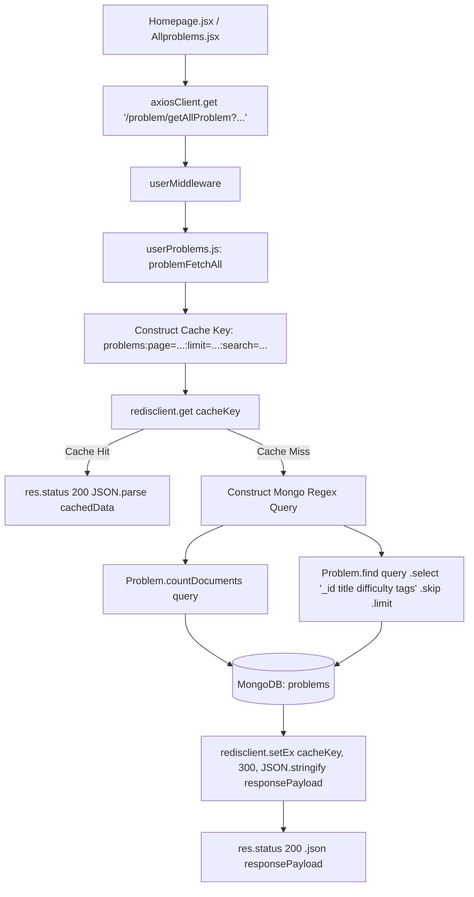

#### Redis Operations
- `GET problems:page=${page}:limit=${limit}:search=${search}...`
- `SETEX cacheKey 300 ${JSON.stringify(responsePayload)}`

---

### API 15: `GET /problem/problemSolvedByUser/user`

#### Purpose
Retrieves the list of problems successfully solved by the authenticated user by populating the `problemSolved` array on their user document.

#### Frontend Entry Point
- Component: `Day02/vite-project/src/pages/Homepage.jsx` (`fetchSolvedProblems`)
- HTTP Client: `axiosClient.get("/problem/problemSolvedByUser/user")`

#### Complete Function Trace
1. `userMiddleware` resolves user ID.
2. `solvedProblem(req, res)` in `userProblems.js`.
3. `User.findById(userId).populate({ path: "problemSolved", select: "_id title difficulty tags" })`.
4. `res.status(200).send(user.problemSolved)`.

---

### API 16: `GET /problem/submittedProblem/:pid`

#### Purpose
Fetches all historical submissions created by the current user for a specific problem ID, ordered chronologically newest first.

#### Frontend Entry Point
- Component: `Day02/vite-project/src/components/SubmissionHistory.jsx`
- HTTP Client: `axiosClient.get("/problem/submittedProblem/" + problemId)`

#### Complete Function Trace
1. `userMiddleware` verifies user identity.
2. `submittedProblem(req, res)` in `userProblems.js`.
3. `Submission.find({ userId, problemId }).sort({ createdAt: -1 })`.
4. `res.status(200).send(ans)`.

---

### API 17: `GET /problem/submission/:id`

#### Purpose
Fetches a single submission by its MongoDB `_id`, populating the associated problem title.

#### Frontend Entry Point
- Component: `Day02/vite-project/src/pages/SubmissionDetail.jsx`
- HTTP Client: `axiosClient.get("/problem/submission/" + id)`

#### Complete Function Trace
1. `userMiddleware` verifies user identity.
2. `getSubmissionById(req, res)` in `userProblems.js`.
3. `Submission.findById(submissionId).populate("problemId", "title")`.
4. `res.status(200).json(submission)`.

---

### API 18: `GET /problem/lastSubmission/:pid`

#### Purpose
Fetches the user's most recent "accepted" submission for a problem to pre-populate their code editor when navigating with `?loadLast=true`.

#### Frontend Entry Point
- Component: `Day02/vite-project/src/pages/Problempage.jsx` (`fetchProblem`)
- HTTP Client: `axiosClient.get("/problem/lastSubmission/" + problemId)`

#### Complete Function Trace
1. `userMiddleware` verifies user identity.
2. `getLastSuccessfulSubmission(req, res)` in `userProblems.js`.
3. `Submission.findOne({ userId, problemId, status: "accepted" }).sort({ createdAt: -1 })`.
4. `res.status(200).json(submission || null)`.

---

### API 19: `POST /submission/submit/:id`

#### Purpose
Asynchronously ingests a code solution for evaluation. Implements rate limiting (max 5 submissions / 60s), SHA-256 idempotency payload verification, Redis job metadata registration, and enqueues an evaluation job into Bull Queue. Returns `202 Accepted` immediately.

#### Frontend Entry Point
- Component: `Day02/vite-project/src/pages/Problempage.jsx`
- Handler: `handleSubmitCode()`
- HTTP Client: `axiosClient.post("/submission/submit/" + problemId, { code, language })`

#### Request Flow
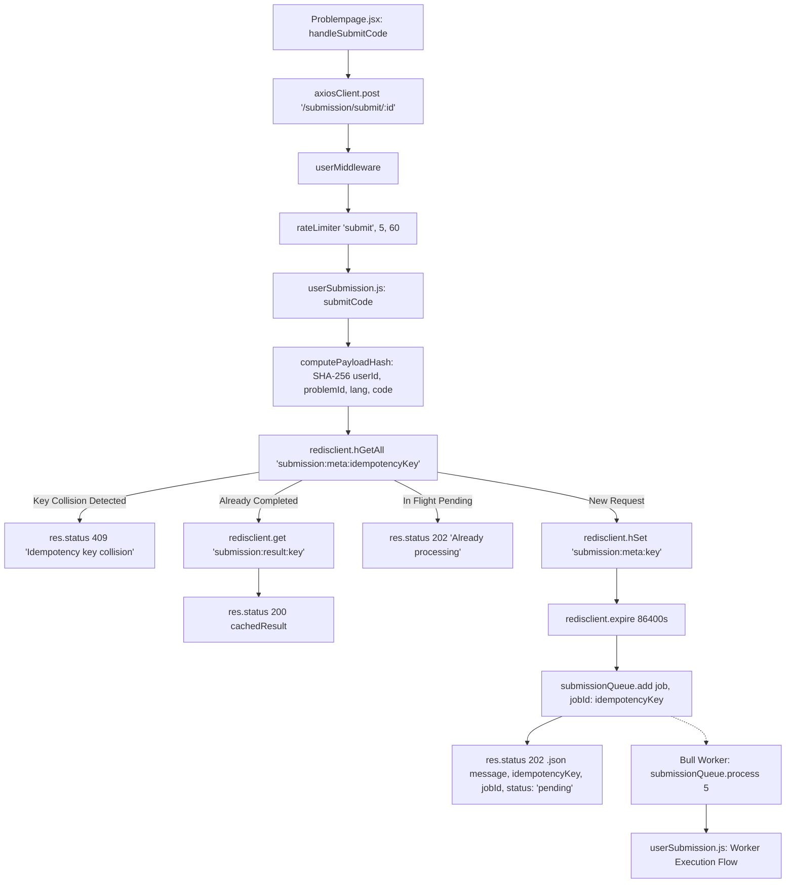

#### Complete Function Trace
1. `Problempage.jsx` invokes `handleSubmitCode()`.
2. `rateLimiter("submit", 5, 60)` verifies rate envelope in Redis.
3. `Day01/src/controllers/userSubmission.js` -> `submitCode(req, res)`:
   - Normalizes language (`cpp` -> `c++`).
   - Generates or reads `idempotencyKey = req.body.idempotencyKey || uuidv4()`.
   - Computes `payloadHash = computePayloadHash(userId, problemId, code, language)`.
   - Checks Redis hash `submission:meta:${idempotencyKey}`:
     - If exists and hashes differ: returns `409 Conflict`.
     - If completed: returns `200 OK` with `submission:result:${idempotencyKey}`.
     - If pending: returns `202 Accepted`.
   - If new request: sets `submission:meta:${idempotencyKey}` status to `"pending"` with 86400s TTL.
4. `submissionQueue.add({ userId, problemId, code, language, idempotencyKey }, { jobId: idempotencyKey })`.
5. Returns `202 Accepted` with `{ idempotencyKey, jobId, status: "pending" }`.

---

### API 20: `GET /submission/status/:idempotencyKey`

#### Purpose
Polling endpoint used by the frontend to poll for submission execution results every 2 seconds until completion.

#### Frontend Entry Point
- Component: `Day02/vite-project/src/pages/Problempage.jsx`
- Poll loop in `handleSubmitCode()`: `axiosClient.get("/submission/status/" + idempotencyKey)`

#### Complete Function Trace
1. `userMiddleware` checks user identity.
2. `checkSubmissionStatus(req, res)` in `userSubmission.js`.
3. Reads Redis `submission:result:${idempotencyKey}`:
   - If present: returns `200 OK` with parsed JSON result.
4. If not present, reads Redis hash `submission:meta:${idempotencyKey}`:
   - If present: returns `202 Accepted` with `{ status: meta.status, idempotencyKey, attemptsMade }`.
5. If neither exists: returns `404 Not Found`.

---

### API 21: `GET /submission/stream/:idempotencyKey`

#### Purpose
Real-time Server-Sent Events (SSE) push endpoint for instant delivery of submission results. Connects an active client stream to a Redis Pub/Sub channel (`submission:stream:${idempotencyKey}`) published by the Bull worker upon evaluation completion.

#### Frontend Entry Point
- Direct EventSource connection or alternative streaming client.

#### Complete Function Trace
1. `userMiddleware` authenticates user.
2. `streamSubmissionStatus(req, res)` in `userSubmission.js`.
3. Sets SSE headers (`text/event-stream`, `Cache-Control: no-cache`, `Connection: keep-alive`).
4. Checks if `submission:result:${idempotencyKey}` is already cached in Redis:
   - If yes: writes `data: ${cachedResult}\n\n` and terminates stream immediately.
5. Writes initial pending frame: `data: {"status":"pending", "idempotencyKey":"..."}\n\n`.
6. Creates dedicated subscriber `createRedisClient()`.
7. Starts 15-second heartbeat timer writing standard comment frames `:\n\n`.
8. `subscriber.subscribe("submission:stream:" + idempotencyKey, (message) => { res.write("data: " + message + "\n\n"); cleanup(); res.end(); })`.
9. Handles socket close (`req.on("close")`) by unsubscribing and disconnecting subscriber client.

---

### API 22: `POST /submission/run/:id`

#### Purpose
Synchronous test-run endpoint. Executes the submitted code against only visible test cases (`visibletestCase`) via Judge0 without persisting results to MongoDB. Protected by a rate limiter of 10 requests / 60 seconds.

#### Frontend Entry Point
- Component: `Day02/vite-project/src/pages/Problempage.jsx`
- Handler: `handleRun()`
- HTTP Client: `axiosClient.post("/submission/run/" + problemId, { code, language })`

#### Request Flow
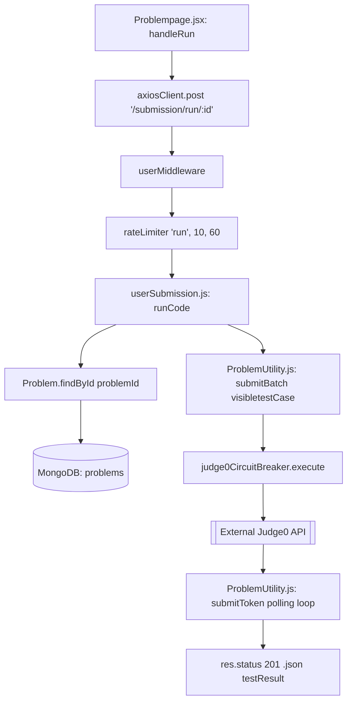

#### External Integrations
- Judge0 CE: `POST /submissions/batch`, `GET /submissions/batch?tokens=...`

---

### API 23: `POST /ai/chat`

#### Purpose
AI-powered DSA tutoring and code review endpoint. Constructs problem-specific system prompts including title, description, and visible test cases, maps message histories, and invokes Google Gemini AI (`gemini-flash-latest`) protected by `geminiCircuitBreaker`.

#### Frontend Entry Point
- Component: `Day02/vite-project/src/components/ChatAi.jsx`
- Handler: `onSubmit(data)`
- HTTP Client: `axiosClient.post("/ai/chat", { messages, problem, code, language })`

#### Request Flow
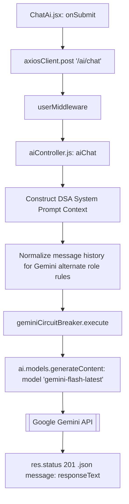

#### System Prompt & Configuration
- SDK: `@google/genai` (`GoogleGenAI`)
- Model: `gemini-flash-latest`
- System Instruction: Restricts AI to DSA tutor role with 6 capabilities (Hint Provider, Code Reviewer, Solution Guide, Complexity Analyzer, Approach Suggester, Test Case Helper), word limits (<150 words by default), and strict prohibitions against non-DSA topics.
- Temperature: `0.5`

#### Error Paths
- Circuit Breaker OPEN: returns `503 Service Unavailable` with message `"AI service is temporarily overloaded. Please retry in a few moments."`
- Invalid token / unauthenticated: returns `401 Unauthorized`.
- Unconfigured API key: returns `503 Service Unavailable`.

---

### API 24: `GET /post/`

#### Purpose
Fetches paginated posts for the FeedLab social feed ordered newest first. Populates author metadata and computes real-time comment counts for each post.

#### Frontend Entry Point
- Component: `Day02/vite-project/src/pages/FeedLab.jsx`
- Trigger: Infinite scroll / intersection observer on `lastPostElementRef`
- HTTP Client: `axios.get("/post?page=" + page + "&limit=10")`

#### Complete Function Trace
1. `userMiddleware` authenticates user.
2. `Day01/src/controllers/userPost.js` -> `getAllPosts(req, res)`.
3. `Post.find().populate("author", "firstName lastName nickname profilePicture role emailId").sort({ createdAt: -1 }).skip(skip).limit(limit)`.
4. `Post.countDocuments()`.
5. Maps posts and calls `Comment.countDocuments({ post: post._id })` concurrently via `Promise.all`.
6. Returns `{ success: true, posts: postsWithCounts, hasMore }`.

---

### API 25: `GET /post/user/:userId`

#### Purpose
Fetches all posts created by a specific user for display on their profile page.

#### Frontend Entry Point
- Component: `Day02/vite-project/src/pages/Profile.jsx`
- HTTP Client: `axiosClient.get("/post/user/" + resolvedProfile._id)`

#### Complete Function Trace
1. `userMiddleware` verifies request.
2. `getPostsByUser(req, res)` in `userPost.js`.
3. `Post.find({ author: userId }).populate("author", "firstName lastName nickname profilePicture").sort({ createdAt: -1 })`.
4. Maps posts and attaches `Comment.countDocuments({ post: post._id })`.
5. `res.status(200).json({ success: true, posts: postsWithCounts })`.

---

### API 26: `GET /post/user/:userId/bookmarked`

#### Purpose
Fetches all posts bookmarked by a user by querying their `bookmarkPosts` array reference.

#### Frontend Entry Point
- Components: `Profile.jsx` (Bookmarked tab), `FeedLab.jsx` (initial bookmark ID set)
- HTTP Client: `axios.get("/post/user/" + user._id + "/bookmarked")`

#### Complete Function Trace
1. `userMiddleware` verifies request.
2. `getBookmarkPostsByUser(req, res)` in `userPost.js`.
3. `User.findById(userId).populate({ path: "bookmarkPosts", populate: { path: "author", select: "firstName lastName nickname profilePicture role emailId" } })`.
4. Filters out null references (deleted posts).
5. Computes comment counts via `Comment.countDocuments`.
6. `res.status(200).json({ success: true, posts: postsWithCounts })`.

---

### API 27: `POST /post/create`

#### Purpose
Asynchronously creates a new social feed post. Enforces rate limiting (10 posts / hour), uploads optional image attachments to Cloudinary (`logiclab_posts`), generates a new MongoDB `_id`, constructs an event envelope, and publishes a `POST_CREATED` event to Kafka topic `feed-events` partitioned by `postId`.

#### Frontend Entry Point
- Component: `Day02/vite-project/src/pages/FeedLab.jsx`
- Handler: `handlePostSubmit()`
- HTTP Client: `axios.post("/post/create", formData, { headers: { "Content-Type": "multipart/form-data" } })`

#### Request Flow
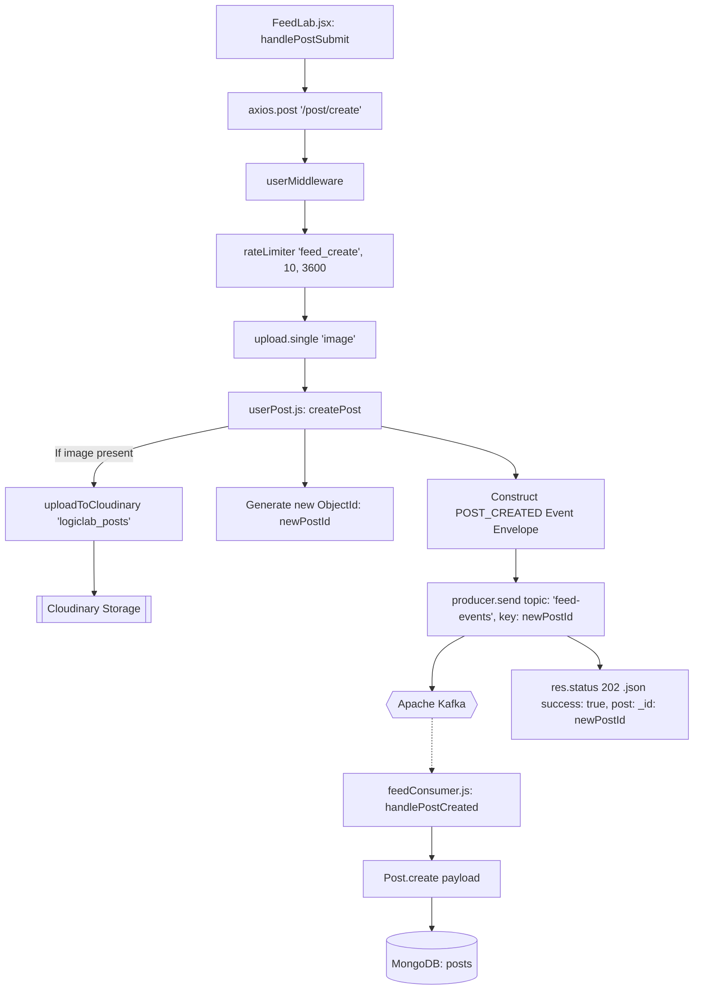

#### Complete Function Trace
1. `FeedLab.jsx` bundles `content` and optional `image`.
2. `rateLimiter("feed_create", 10, 3600)` checks Redis rate limit.
3. `upload.single("image")` parses multipart form data.
4. `createPost(req, res)` in `userPost.js`:
   - If image present, uploads to Cloudinary folder `logiclab_posts`.
   - Generates `newPostId = new mongoose.Types.ObjectId()`.
   - Builds Kafka event envelope:
     ```javascript
     {
       eventId: uuidv4(),
       eventType: "POST_CREATED",
       entityId: newPostId.toString(),
       actorId: req.result._id.toString(),
       recipientId: null,
       timestamp: Date.now(),
       payload: { _id: newPostId, content, tags, image, imagePublicId, author }
     }
     ```
   - Publishes to Kafka topic `feed-events` with partition key `newPostId.toString()`.
5. Returns `202 Accepted` with `{ success: true, post: { _id: newPostId } }`.
6. Asynchronously in `feedConsumer.js`:
   - Checks Redis deduplication key `event:processed:feed:${eventId}`.
   - Calls `handlePostCreated(payload)` -> `Post.create()`.

---

### API 28: `DELETE /post/:id`

#### Purpose
Deletes a post authored by the authenticated user. Deletes the image from Cloudinary, cascade deletes all associated comments in MongoDB, removes the post document, and deletes the post score from Redis.

#### Frontend Entry Point
- Component: `Day02/vite-project/src/pages/FeedLab.jsx`
- Handler: `handleDeletePost(id)`
- HTTP Client: `axios.delete("/post/" + id)`

#### Complete Function Trace
1. `userMiddleware` verifies request.
2. `deletePost(req, res)` in `userPost.js`.
3. `Post.findById(id)` verifies author matches `req.result._id`.
4. If `post.imagePublicId` exists: `deleteFromCloudinary(post.imagePublicId)`.
5. `Comment.deleteMany({ post: id })`.
6. `post.deleteOne()`.
7. `redisclient.del("post:" + id + ":score")`.
8. `res.status(200).json({ success: true, message: "Post deleted successfully" })`.

---

### API 29: `POST /post/upvote/:id`

#### Purpose
Executes an atomic post upvote/un-upvote transition using a Redis Lua script, updates vote states and score deltas, and dispatches an `UPVOTE` event to Kafka topic `feed-events` partitioned by `postId`.

#### Frontend Entry Point
- Component: `Day02/vite-project/src/pages/FeedLab.jsx`
- Handler: `handleVote(postId, 'upvote')`
- HTTP Client: `axios.post("/post/upvote/" + id)`

#### Request Flow
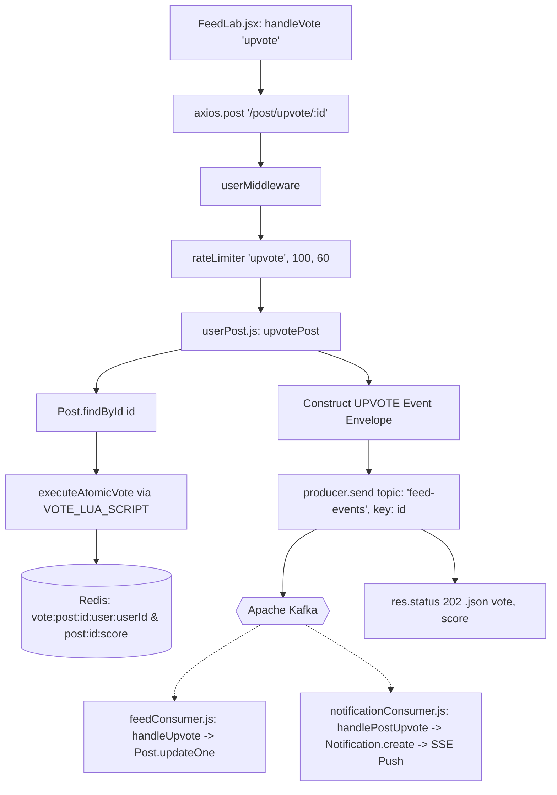

#### Redis Lua Script Voting Logic (`VOTE_LUA_SCRIPT`)
- Target: `KEYS[1] = vote:post:${id}:user:${userId}`, `KEYS[2] = post:${id}:score`
- If user already upvoted: deletes key `KEYS[1]`, decrements score by 1 (`scoreDelta = -1`), transitions to `"none"`.
- If user previously downvoted: changes key `KEYS[1]` to `"upvote"`, changes score by +2 (`scoreDelta = 2`).
- If user had no vote: sets key `KEYS[1]` to `"upvote"`, increments score by +1 (`scoreDelta = 1`).
- Atomically runs `INCRBY` on `KEYS[2]` and sets a 7-day TTL (`604800s`).

#### Downstream Kafka Consumers
1. `feed-processing-group` in `feedConsumer.js`: updates `Post.updateOne` using `$addToSet`/`$pull` on `upvotes`/`downvotes` arrays and increments/decrements `upvotesCount`/`downvotesCount`.
2. `notification-processing-group` in `notificationConsumer.js`: checks deduplication, writes `Notification.create({ type: 'POST_LIKE' })`, and pushes live notification to recipient's SSE socket.

---

### API 30: `POST /post/downvote/:id`

#### Purpose
Executes an atomic post downvote/un-downvote transition using the Redis Lua script, updates vote states and score deltas, and dispatches a `DOWNVOTE` event to Kafka topic `feed-events`.

#### Frontend Entry Point
- Component: `Day02/vite-project/src/pages/FeedLab.jsx`
- Handler: `handleVote(postId, 'downvote')`
- HTTP Client: `axios.post("/post/downvote/" + id)`

#### Complete Function Trace
1. `userMiddleware` verifies request.
2. `downvotePost(req, res)` in `userPost.js`.
3. Verifies post existence via `Post.findById(id)`.
4. Executes `executeAtomicVote` with `targetAction: "downvote"`.
5. Publishes `DOWNVOTE` event to Kafka topic `feed-events` partitioned by `postId`.
6. `res.status(202).json({ success: true, message: "Downvote event queued", vote: voteResult.newVote, score: voteResult.newScore })`.

---

### API 31: `POST /post/bookmark/:id`

#### Purpose
Toggles a post bookmark for the authenticated user using atomic MongoDB `$pull` / `$addToSet` operations on `user.bookmarkPosts`.

#### Frontend Entry Point
- Component: `Day02/vite-project/src/pages/FeedLab.jsx`
- Handler: `handleToggleBookmark(postId)`
- HTTP Client: `axios.post("/post/bookmark/" + id)`

#### Complete Function Trace
1. `userMiddleware` verifies request.
2. `toggleBookmarkPost(req, res)` in `userPost.js`.
3. `Post.findById(id)` checks post existence.
4. `User.findById(userId).select("bookmarkPosts")`.
5. If post ID is present in `bookmarkPosts`:
   - `User.updateOne({ _id: userId }, { $pull: { bookmarkPosts: id } })`.
   - `res.status(200).json({ success: true, isBookmarked: false })`.
6. If post ID is not present:
   - `User.updateOne({ _id: userId }, { $addToSet: { bookmarkPosts: id } })`.
   - `res.status(200).json({ success: true, isBookmarked: true })`.

---

### API 32: `POST /comment/:postId`

#### Purpose
Asynchronously posts a comment or nested reply to a post. Pre-generates the comment `_id` for optimistic UI, constructs a Kafka event envelope, and publishes a `COMMENT` event to topic `feed-events` partitioned by `postId`.

#### Frontend Entry Point
- Component: `Day02/vite-project/src/components/CommentSection.jsx`
- Handler: `handleSubmit(content, parentCommentId)`
- HTTP Client: `axios.post("/comment/" + postId, { content, parentCommentId })`

#### Request Flow
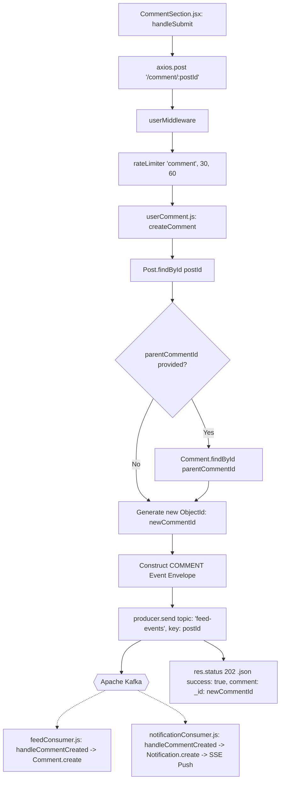

#### Complete Function Trace
1. `CommentSection.jsx` invokes `handleSubmit()`.
2. `rateLimiter("comment", 30, 60)` verifies user has not exceeded 30 comments per minute.
3. `userComment.js` -> `createComment(req, res)`:
   - `Post.findById(postId)` retrieves post author.
   - If `parentCommentId` provided: `Comment.findById(parentCommentId)` retrieves parent comment author.
   - Generates `newCommentId = new mongoose.Types.ObjectId()`.
   - Constructs Kafka event with `eventType: "COMMENT"` and payload containing comment attributes, `postAuthorId`, `parentCommentAuthorId`, and rich `sender` snapshot.
   - `producer.send({ topic: "feed-events", messages: [{ key: postId.toString(), value: JSON.stringify(event) }] })`.
4. Returns `202 Accepted` with `{ success: true, comment: { _id: newCommentId } }`.
5. Downstream `feedConsumer.js` executes `handleCommentCreated` -> `Comment.create()`.
6. Downstream `notificationConsumer.js` executes `handleCommentCreated` -> creates `COMMENT_CREATED` notification for post author or parent comment author -> pushes via SSE.

---

### API 33: `DELETE /comment/:commentId`

#### Purpose
Deletes a comment and all its nested replies (`parentComment: commentId`), and deletes its vote score key from Redis.

#### Frontend Entry Point
- Component: `Day02/vite-project/src/components/CommentSection.jsx`
- Handler: `handleDelete(commentId)`
- HTTP Client: `axios.delete("/comment/" + commentId)`

#### Complete Function Trace
1. `userMiddleware` verifies user identity.
2. `deleteComment(req, res)` in `userComment.js`.
3. `Comment.findById(commentId)` verifies author matches `req.result._id`.
4. `Comment.deleteMany({ $or: [{ _id: commentId }, { parentComment: commentId }] })`.
5. `redisclient.del("comment:" + commentId + ":score")`.
6. `res.status(200).json({ success: true, message: "Comment deleted successfully!" })`.

---

### API 34: `POST /comment/upvote/:commentId`

#### Purpose
Executes an atomic upvote transition on a comment using the Redis Lua script and publishes an `UPVOTE_COMMENT` event to Kafka topic `feed-events` partitioned by `commentId`.

#### Frontend Entry Point
- Component: `Day02/vite-project/src/components/CommentSection.jsx`
- Handler: `handleUpvote(commentId)`
- HTTP Client: `axios.post("/comment/upvote/" + commentId)`

#### Complete Function Trace
1. `userMiddleware` verifies authentication.
2. `upvoteComment(req, res)` in `userComment.js`.
3. `Comment.findById(commentId)` checks comment existence.
4. Executes `executeAtomicVote` with keys `vote:comment:${commentId}:user:${userId}` and `comment:${commentId}:score`.
5. Publishes `UPVOTE_COMMENT` event to Kafka topic `feed-events` with partition key `commentId`.
6. Returns `202 Accepted` with `{ success: true, vote: voteResult.newVote, score: voteResult.newScore }`.
7. Downstream `feedConsumer.js` updates `Comment.updateOne`.
8. Downstream `notificationConsumer.js` checks deduplication, persists `COMMENT_LIKE` notification, and pushes via SSE.

---

### API 35: `POST/ALL /graphql`

#### Purpose
GraphQL query endpoint providing nested comment tree retrieval with resolved author information for a specific post.

#### Frontend Entry Point
- Component: `Day02/vite-project/src/components/CommentSection.jsx`
- Handler: `fetchComments()`
- HTTP Client: `axios.post("/graphql", { query: "...", variables: { postId } })`

#### GraphQL Schema Trace (`Day01/src/graphql/commentSchema.js`)
```graphql
query GetComments($postId: ID!) {
  comments(postId: $postId) {
    id
    content
    createdAt
    parentComment
    upvotesCount
    upvotes
    author {
      id
      firstName
      lastName
      nickname
      profilePicture
    }
  }
}
```
1. `graphql-http` handler intercepts `ALL /graphql`.
2. Resolves `RootQueryType.fields.comments`:
   - Executes resolver: `Comment.find({ post: args.postId }).sort({ createdAt: -1 })`.
3. For each comment requesting `author`:
   - Executes nested field resolver: `User.findById(parent.author)`.

---

### API 36: `GET /health` (Primary Backend)

#### Purpose
Health check endpoint reporting primary backend service status, process uptime, and system timestamp.

#### Complete Function Trace
1. Defined in `Day01/src/index.js` line 30:
   ```javascript
   app.get("/health", (req, res) => {
     res.status(200).json({
       status: "ok",
       message: "Server is healthy",
       uptime: process.uptime(),
       timestamp: new Date().toISOString(),
     });
   });
   ```

---

### API 37: `GET /health` (Notification Microservice)

#### Purpose
Health check endpoint reporting notification microservice status, process uptime, and system timestamp.

#### Complete Function Trace
1. Defined in `NotificationService/src/index.js` line 32:
   ```javascript
   app.get("/health", (req, res) => {
     res.status(200).json({
       status: "ok",
       service: "notification-microservice",
       uptime: process.uptime(),
       timestamp: new Date().toISOString(),
     });
   });
   ```

---

### API 38: `GET /api/notifications/stream` (SSE Gateway)

#### Purpose
Server-Sent Events (SSE) streaming endpoint establishing a persistent HTTP connection to stream real-time social notifications directly to the browser. Enforces a maximum limit of 5 concurrent connections per user and transmits keep-alive comment frames every 30 seconds.

#### Frontend Entry Point
- Context: `Day02/vite-project/src/context/NotificationContext.jsx`
- Handler: `connectSSE()`
- Browser Transport: `new EventSource("http://localhost:3001/api/notifications/stream", { withCredentials: true })`

#### Request Flow
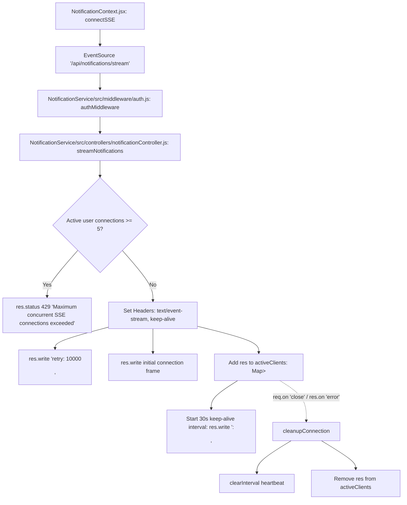

#### Complete Function Trace
1. `NotificationContext.jsx` instantiates `EventSource` with `withCredentials: true`.
2. `NotificationService/src/middleware/auth.js` verifies `token` cookie or `Authorization: Bearer` header.
3. `streamNotifications(req, res)` in `notificationController.js`:
   - Checks `activeClients.get(userId)`. If size >= 5, returns `429 Too Many Requests`.
   - Sets headers `Content-Type: text/event-stream`, `Cache-Control: no-cache, no-transform`, `Connection: keep-alive`.
   - Sends initial reconnection directive `retry: 10000\n` and handshake frame.
   - Registers `res` into `activeClients.get(userId)`.
   - Starts 30s heartbeat interval writing comment frames `:\n\n`.
   - Listens to `req.on("close")` and `res.on("error")` to delete socket from `activeClients` and clear timers.

---

### API 39: `GET /api/notifications/`

#### Purpose
Fetches a paginated list of social notifications for the authenticated user, along with the total unread notification count.

#### Frontend Entry Point
- Context: `Day02/vite-project/src/context/NotificationContext.jsx`
- Handler: `fetchNotifications(page, replace)`
- HTTP Client: `axiosNotification.get("/api/notifications?page=" + targetPage + "&limit=15")`

#### Complete Function Trace
1. `authMiddleware` verifies JWT token.
2. `getNotifications(req, res)` in `notificationController.js`.
3. `Notification.find({ recipient: userId }).sort({ createdAt: -1 }).skip(skip).limit(limit)`.
4. Concurrently queries `Notification.countDocuments({ recipient: userId })` and `Notification.countDocuments({ recipient: userId, isRead: false })`.
5. Returns `{ success: true, notifications, pagination: { page, limit, total, hasMore }, unreadCount }`.

---

### API 40: `PATCH /api/notifications/read-all`

#### Purpose
Marks all unread notifications for the authenticated user as read in MongoDB.

#### Frontend Entry Point
- Context: `Day02/vite-project/src/context/NotificationContext.jsx`
- Handler: `markAllAsRead()`
- HTTP Client: `axiosNotification.patch("/api/notifications/read-all")`

#### Complete Function Trace
1. `authMiddleware` verifies JWT.
2. `markAllAsRead(req, res)` in `notificationController.js`.
3. `Notification.updateMany({ recipient: userId, isRead: false }, { $set: { isRead: true } })`.
4. Returns `{ success: true, message: "All notifications marked as read.", modifiedCount }`.

---

### API 41: `PATCH /api/notifications/:id/read`

#### Purpose
Marks a specific notification as read in MongoDB.

#### Frontend Entry Point
- Component: `Day02/vite-project/src/pages/Notifications.jsx` (`handleNotificationClick`)
- Context: `NotificationContext.jsx` (`markAsRead`)
- HTTP Client: `axiosNotification.patch("/api/notifications/" + id + "/read")`

#### Complete Function Trace
1. `authMiddleware` verifies JWT.
2. `markAsRead(req, res)` in `notificationController.js`.
3. `Notification.findOneAndUpdate({ _id: id, recipient: userId }, { $set: { isRead: true } }, { new: true })`.
4. Returns `{ success: true, notification }`.

---

### API 42: `DELETE /api/notifications/:id`

#### Purpose
Deletes a specific notification belonging to the authenticated user from MongoDB.

#### Frontend Entry Point
- Context: `Day02/vite-project/src/context/NotificationContext.jsx`
- Handler: `deleteNotification(id)`
- HTTP Client: `axiosNotification.delete("/api/notifications/" + id)`

#### Complete Function Trace
1. `authMiddleware` verifies JWT.
2. `deleteNotification(req, res)` in `notificationController.js`.
3. `Notification.findOneAndDelete({ _id: id, recipient: userId })`.
4. Returns `{ success: true, message: "Notification deleted successfully." }`.

---

## 4. LogicLab Asynchronous Code Submission & Evaluation Deep Trace

The code evaluation pipeline is the most critical subsystem in LogicLab. It completely decouples synchronous HTTP request handling from asynchronous sandbox execution.

### Asynchronous Submission Execution Pipeline

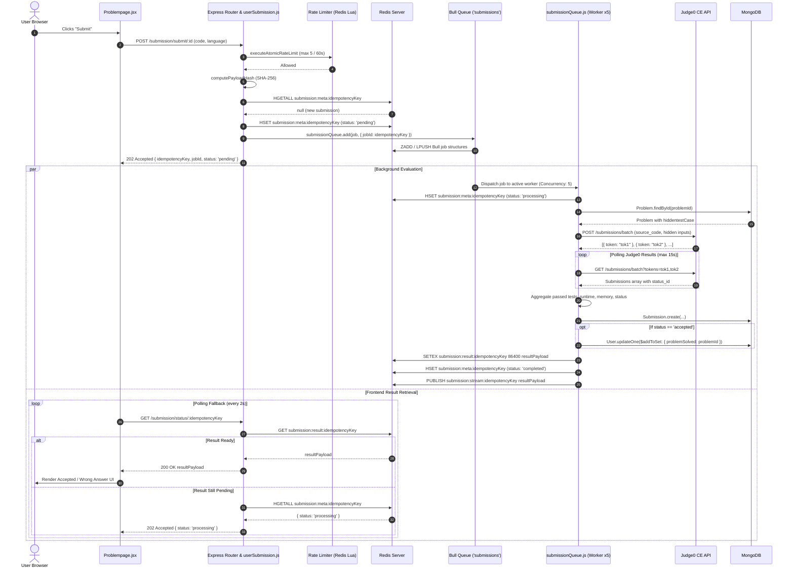

### Contrast: Synchronous Test-Run (`POST /submission/run/:id`)

Unlike the submission pipeline, the test-run pipeline is fully synchronous and blocking:
1. `Problempage.jsx` calls `POST /submission/run/:id`.
2. `runCode()` fetches visible test cases from MongoDB (`Problem.findById`).
3. Formats batch payload and submits to Judge0 via `submitBatch`.
4. Polls Judge0 tokens inside the request lifecycle via `submitToken` (up to 15 seconds).
5. Returns raw test case outputs directly in the HTTP response (`res.status(201).json(testResult)`).
6. No records are written to MongoDB `submissions`, no Redis result keys are stored, and Bull Queue is not invoked.

---

## 5. Bull Queue + Redis Deep Trace

### Queue Configuration (`Day01/src/workers/submissionQueue.js`)
- **Queue Name**: `"submissions"`
- **Redis Connection**: Host, port, and password parsed from `REDIS_HOST`, `REDIS_PORT`, `REDIS_PASS`.
- **Default Job Options**:
  - `attempts: 3`: Maximum retry attempts on transient failures.
  - `backoff`: Exponential backoff starting with a `2000ms` initial delay.
  - `removeOnComplete: 1000`: Retains the last 1,000 completed jobs in Redis for auditing.
  - `removeOnFail: 2000`: Retains the last 2,000 failed jobs for debugging.
  - `stalledInterval: 15000`: Scans for stalled jobs every 15 seconds.
  - `maxStalledCount: 2`: Allows a stalled job to be re-assigned at most twice before failing.
- **Worker Concurrency**: Set to `5` via `SUBMISSION_WORKER_CONCURRENCY` (default: 5).

### Job Lifecycle States in Redis
1. **Creation**:
   - `HSET submission:meta:${idempotencyKey}` with fields: `payloadHash`, `userId`, `problemId`, `status: "pending"`, `createdAt`, `jobId`.
   - Bull creates internal keys: `bull:submissions:id`, `bull:submissions:wait`, `bull:submissions:active`.
2. **Processing**:
   - Worker picks up job: `HSET submission:meta:${idempotencyKey}` with `status: "processing"`, `attemptsMade: N`, `updatedAt`.
3. **Completion**:
   - `SETEX submission:result:${idempotencyKey} 86400 ${JSON.stringify(resultPayload)}`.
   - `HSET submission:meta:${idempotencyKey}` with `status: "completed"`, `completedAt`.
   - `PUBLISH submission:stream:${idempotencyKey} ${JSON.stringify(resultPayload)}`.
4. **Terminal Failure**:
   - If retries are exhausted or `error.isPermanent === true`:
   - `SETEX submission:result:${idempotencyKey} 86400 ${JSON.stringify(failedPayload)}`.
   - `HSET submission:meta:${idempotencyKey}` with `status: "failed"`, `errorMessage`.
   - `PUBLISH submission:stream:${idempotencyKey} ${JSON.stringify(failedPayload)}`.

---

## 6. Judge0 Integration Architecture

### Endpoint Details
- **Batch Submission Endpoint**: `POST https://judge0-ce.p.rapidapi.com/submissions/batch?base64_encoded=false`
- **Batch Retrieval Endpoint**: `GET https://judge0-ce.p.rapidapi.com/submissions/batch?tokens=${tokens.join(",")}&base64_encoded=false&fields=*`
- **Headers**:
  - `x-rapidapi-key`: `process.env.JUDGE0_KEY` || `process.env.RAPIDAPI_KEY`
  - `x-rapidapi-host`: `judge0-ce.p.rapidapi.com`
  - `Content-Type`: `application/json`
- **Request Timeout**: `10000ms` (10 seconds) on every Axios call.

### Language ID Mapping (`getLanguageById`)
- `"c++"` / `"cpp"` -> Language ID `54` (GCC 9.2.0)
- `"java"` -> Language ID `62` (OpenJDK 13.0.1)
- `"javascript"` / `"js"` -> Language ID `63` (Node.js 12.14.0)

### Judge0 Status ID Mapping
- `status_id === 1`: In Queue
- `status_id === 2`: Processing
- `status_id === 3`: Accepted
- `status_id === 4`: Wrong Answer
- `status_id === 5`: Time Limit Exceeded
- `status_id === 6`: Compilation Error
- `status_id >= 7`: Runtime Error (SIGSEGV, SIGXFSZ, etc.)

### Circuit Breaker Protection (`judge0CircuitBreaker`)
- Failure Threshold: 5 consecutive failures
- Reset Timeout: `20000ms` (20 seconds)
- Retryable Classification: `503`, `429`, `500+`, `ECONNABORTED`, `ETIMEDOUT`.
- Non-retryable Classification: `400 Bad Request` or malformed payloads flag `err.isPermanent = true` to prevent useless worker retries.

---

## 7. Kafka Event-Driven Architecture

### Topic Configuration
- **Topic Name**: `feed-events`
- **Partitions**: 3 partitions
- **Replication Factor**: 3 on Aiven Cloud, 1 on local development.
- **Partition Key**: Keyed by `entityId` (`postId` or `commentId`) to guarantee partition-level FIFO ordering for all actions on that entity.

### Standard Event Envelope Schema
```typescript
interface LogicLabEventEnvelope {
  eventId: string;           // UUIDv4 unique identifier for deduplication
  eventType: "POST_CREATED" | "UPVOTE" | "DOWNVOTE" | "COMMENT" | "UPVOTE_COMMENT";
  type: string;              // Backward compatibility alias for eventType
  entityId: string;          // Target entity (postId or commentId) - used as Kafka Message Key
  actorId: string;           // User ID who performed the action
  recipientId: string | null;// Post/comment author to be notified
  timestamp: number;         // Epoch timestamp (Date.now())
  payload: Record<string, any>; // Specific entity data or vote transitions
}
```

### Consumer Groups

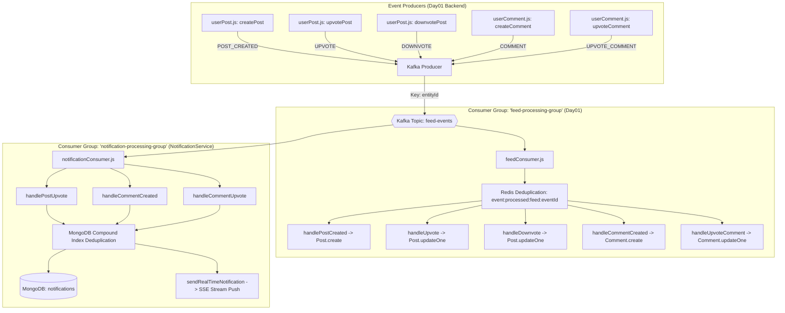

---

## 8. Real-Time Notification & SSE Architecture

### Microservice Transport Overview
- Real-time notification delivery operates exclusively through Server-Sent Events (SSE).
- Client connects via `new EventSource("http://localhost:3001/api/notifications/stream", { withCredentials: true })`.
- Active connections are tracked in-memory using `activeClients = new Map<string, Set<Response>>()`.

### Connection Hardening & Defense
1. **Per-User Connection Quota**: Enforces a maximum of 5 concurrent SSE connections per user (`MAX_SSE_PER_USER = 5`). If an 6th connection is attempted, returns `429 Too Many Requests`.
2. **Keep-Alive Heartbeats**: Sends standard SSE comment frames `:\n\n` every 30 seconds to prevent reverse proxy (Nginx/Cloudflare) timeouts.
3. **Reconnection Directive**: Transmits `retry: 10000\n` upon connection handshake to instruct browser `EventSource` to retry after 10 seconds if disconnected.
4. **Graceful Teardown**: Upon server shutdown (`SIGINT`/`SIGTERM`), calls `closeAllSSEConnections()`, sending a `SERVER_SHUTDOWN` event frame to all connected sockets before closing.

---

## 9. Authentication & Authorization Flow

### Security Model
- **Token Format**: Standard JSON Web Token (JWT) signed with `process.env.JWT_KEY`.
- **Payload Schema**: `{ _id: string, emailId: string, role: "user" | "admin" }`.
- **Token Transport**: Stored inside an HTTP-only cookie named `token`.
- **Cookie Security Options**:
  ```javascript
  const options = {
    sameSite: isLocalhost ? "lax" : "none",
    secure: !isLocalhost,
    maxAge: 7200 * 1000 // 2 hours
  };
  ```
- **Distributed Revocation (Blocklisting)**:
  - When a user logs out (`POST /user/logout`), the token is placed in Redis:
    ```javascript
    await redisclient.set(`token:${token}`, "Blocked");
    await redisclient.expireAt(`token:${token}`, payload.exp);
    ```
  - Both `userMiddleware` and `adminMiddleware` check `await redisclient.exists("token:" + token)`. If found, the request is immediately rejected with `401 Unauthorized`.
- **Role-Based Access Control (RBAC)**:
  - `adminMiddleware` enforces `payload.role === "admin"`. If a regular user attempts access, it immediately rejects the request.

---

## 10. AI / Gemini Integration Architecture

- **Client Library**: `@google/genai` (`GoogleGenAI` class).
- **Model**: `gemini-flash-latest`.
- **Context Injection**:
  - `title`, `description`, and truncated visible test cases (`visibletestCase.slice(0, 2)`) from the problem document.
  - Active editor code from Monaco editor (`code`).
  - Active language selection (`language`).
  - Client message history (truncated to the last 6 messages to conserve context tokens).
- **History Normalization**: Gemini requires strictly alternating roles starting with `"user"`. `aiController.js` normalizes repeated user/model messages by concatenating their text parts.
- **Circuit Breaker**: Protected by `geminiCircuitBreaker` (threshold: 4 failures, reset timeout: 20 seconds).

---

## 11. RAG / Vector Search Analysis

> [!NOTE]
> **RAG / Vector-Search Verification Statement**:  
> No RAG (Retrieval-Augmented Generation) or vector-search flows (e.g., embeddings, Pinecone, ChromaDB, Milvus, Qdrant, LangChain, or MongoDB Atlas Vector Search) were identified in the inspected source code. The AI assistant relies strictly on structured in-memory prompt injection passing the problem description, code buffer, and test cases directly to `gemini-flash-latest`.

---

## 12. Redis Operations & Key Schema Reference

| Redis Key Pattern | Data Structure | TTL | Purpose |
|-------------------|----------------|-----|---------|
| `token:${token}` | String (`"Blocked"`) | `payload.exp` | Token revocation blocklist for logged-out JWTs |
| `ratelimit:${action}:${identifier}` | Integer counter | Dynamic (`windowSeconds`) | Atomic rate limiting via `RATE_LIMIT_LUA_SCRIPT` |
| `rate:submit:${userId}` | Sorted Set | 3600s | Sliding window submission rate limiter helper |
| `profile:public:${id}` | String (JSON) | 3600s | Cached public user profile |
| `problem:${id}` | String (JSON) | 3600s | Cached problem details |
| `problems:page=...:limit=...` | String (JSON) | 300s | Cached paginated problem listings |
| `submission:meta:${idempotencyKey}` | Hash | 86400s (1 day) | Tracks submission status, payload hash, and attempts |
| `submission:result:${idempotencyKey}` | String (JSON) | 86400s (1 day) | Final evaluated submission result |
| `submission:stream:${idempotencyKey}` | Pub/Sub Channel | — | Real-time push channel for submission completion |
| `vote:post:${id}:user:${userId}` | String (`"upvote"` / `"downvote"`) | 86400s (1 day) | Atomic post vote state for a user |
| `post:${id}:score` | Integer counter | 604800s (7 days) | Fast cached aggregate vote score for a post |
| `vote:comment:${id}:user:${userId}` | String (`"upvote"`) | 86400s (1 day) | Atomic comment vote state for a user |
| `comment:${id}:score` | Integer counter | 604800s (7 days) | Fast cached aggregate vote score for a comment |
| `event:processed:feed:${eventId}` | String (`"1"`) | 604800s (7 days) | Redis NX deduplication for Kafka feed consumer |

---

## 13. MongoDB Collections & Operations Matrix

| Collection Name | Schema File | Key Indexes | Write Operations | Read Operations |
|-----------------|-------------|-------------|------------------|-----------------|
| `users` | `Day01/src/models/user.js` | `emailId: 1 (unique)` | `create`, `findByIdAndUpdate`, `findByIdAndDelete`, `updateOne ($addToSet, $pull)` | `exists`, `findOne`, `findById` |
| `problems` | `Day01/src/models/problems.js` | `title: 1` | `create`, `findByIdAndUpdate`, `findByIdAndDelete` | `find.skip.limit`, `findById`, `countDocuments` |
| `submissions` | `Day01/src/models/submission.js` | `userId: 1, problemId: 1 (compound)` | `create`, `deleteMany` (cascade) | `find.sort`, `findOne.sort`, `findById` |
| `posts` | `Day01/src/models/post.js` | `createdAt: -1` | `create` (via consumer), `deleteOne`, `updateOne ($addToSet, $pull, $inc)` | `find.populate.skip.limit`, `findById`, `countDocuments` |
| `comments` | `Day01/src/models/comment.js` | `post: 1`, `parentComment: 1`, `createdAt: -1` | `create` (via consumer), `deleteMany`, `updateOne ($addToSet, $pull, $inc)` | `find.sort`, `findById`, `countDocuments` |
| `notifications` | `NotificationService/src/models/notification.js` | `recipient: 1`, `isRead: 1`, `createdAt: 1 (TTL 30d)`, Compound dedup index | `create` (via consumer), `findOneAndUpdate`, `updateMany`, `findOneAndDelete` | `find.sort.skip.limit`, `countDocuments`, `findOne` |

---

## 14. Function Reference

| Function Name | Source File | Invoked By | Functions Invoked | Architectural Purpose |
|---------------|-------------|------------|-------------------|-----------------------|
| `register` | `Day01/src/controllers/userAuthenticate.js` | `userAuth.js` route | `validate`, `User.exists`, `bcrypt.hash`, `User.create`, `jwt.sign` | Registers new user and sets auth cookie |
| `login` | `Day01/src/controllers/userAuthenticate.js` | `userAuth.js` route | `User.findOne`, `bcrypt.compare`, `jwt.sign` | Authenticates credentials and sets auth cookie |
| `logout` | `Day01/src/controllers/userAuthenticate.js` | `userAuth.js` route | `jwt.decode`, `redisclient.set`, `redisclient.expireAt` | Blocklists JWT in Redis and clears cookie |
| `getPublicProfile` | `Day01/src/controllers/userAuthenticate.js` | `userAuth.js` route | `redisclient.get`, `User.findById.populate`, `redisclient.setEx` | Cached public user profile retrieval |
| `updateProfile` | `Day01/src/controllers/userAuthenticate.js` | `userAuth.js` route | `uploadToCloudinary`, `User.findByIdAndUpdate`, `redisclient.del` | Updates user profile and uploads avatar |
| `problemCreate` | `Day01/src/controllers/userProblems.js` | `problemCreator.js` route | `getLanguageById`, `submitBatch`, `submitToken`, `Problem.create`, `invalidateProblemCaches` | Validates reference solutions and creates problem |
| `problemFetchAll` | `Day01/src/controllers/userProblems.js` | `problemCreator.js` route | `redisclient.get`, `Problem.countDocuments`, `Problem.find`, `redisclient.setEx` | Paginated, cached problem search |
| `submitCode` | `Day01/src/controllers/userSubmission.js` | `submit.js` route | `computePayloadHash`, `redisclient.hGetAll`, `redisclient.hSet`, `submissionQueue.add` | Asynchronously ingests submission and enqueues Bull job |
| `checkSubmissionStatus`| `Day01/src/controllers/userSubmission.js` | `submit.js` route | `redisclient.get`, `redisclient.hGetAll` | Polling endpoint for submission evaluation status |
| `streamSubmissionStatus`| `Day01/src/controllers/userSubmission.js`| `submit.js` route | `createRedisClient`, `subscriber.subscribe`, `res.write` | SSE streaming endpoint for real-time submission status push |
| `runCode` | `Day01/src/controllers/userSubmission.js` | `submit.js` route | `Problem.findById`, `submitBatch`, `submitToken` | Synchronously runs code against visible test cases |
| `aiChat` | `Day01/src/controllers/aiController.js` | `aiRoute.js` route | `geminiCircuitBreaker.execute`, `ai.models.generateContent` | Generates DSA tutoring responses via Gemini |
| `createPost` | `Day01/src/controllers/userPost.js` | `postRoute.js` route | `uploadToCloudinary`, `producer.send` | Uploads image and publishes `POST_CREATED` to Kafka |
| `upvotePost` | `Day01/src/controllers/userPost.js` | `postRoute.js` route | `executeAtomicVote`, `producer.send` | Atomic Redis vote update and Kafka event publish |
| `createComment` | `Day01/src/controllers/userComment.js` | `commentRoute.js` route | `Post.findById`, `Comment.findById`, `producer.send` | Publishes `COMMENT` event to Kafka |
| `executeAtomicVote` | `Day01/src/config/redis.js` | `userPost.js`, `userComment.js` | `redisclient.eval(VOTE_LUA_SCRIPT)` | Atomically transitions vote states and scores |
| `executeAtomicRateLimit`| `Day01/src/config/redis.js` | `rateLimiter.js` | `redisclient.eval(RATE_LIMIT_LUA_SCRIPT)` | Atomic Redis sliding window counter |
| `submitBatch` | `Day01/src/utilities/ProblemUtility.js` | `userSubmission.js`, `userProblems.js` | `judge0CircuitBreaker.execute`, `axios.request` | Submits batch code payload to Judge0 |
| `submitToken` | `Day01/src/utilities/ProblemUtility.js` | `userSubmission.js`, `userProblems.js` | `judge0CircuitBreaker.execute`, `axios.request`, `waiting` | Polls Judge0 batch results until completion |
| `handlePostCreated` | `Day01/src/workers/feedConsumer.js` | `startFeedConsumer` | `Post.create` | Persists post from Kafka event |
| `handleUpvote` | `Day01/src/workers/feedConsumer.js` | `startFeedConsumer` | `Post.findById`, `Post.updateOne` | Synchronizes post upvote counts in MongoDB |
| `streamNotifications` | `NotificationService/src/controllers/notificationController.js` | `notificationRoutes.js` | `res.writeHead`, `activeClients.set`, `setInterval` | Establishes persistent SSE socket for user notifications |
| `sendRealTimeNotification`| `NotificationService/src/controllers/notificationController.js`| `notificationConsumer.js` | `activeClients.get`, `res.write` | Dispatches live notification event to active SSE sockets |
| `handlePostUpvote` | `NotificationService/src/workers/notificationConsumer.js` | `startNotificationConsumer` | `Notification.findOne`, `Notification.create`, `sendRealTimeNotification` | Creates `POST_LIKE` notification and triggers SSE push |

---

## 15. File Reference

| Layer | Absolute / Relative Path | Key Exported Symbols & Handlers |
|-------|--------------------------|---------------------------------|
| Primary Entry | `Day01/src/index.js` | `app`, `server`, `InitializeConnection`, `gracefulShutdown` |
| Route Router | `Day01/src/routes/userAuth.js` | `AuthRouter` (APIs 1-9) |
| Route Router | `Day01/src/routes/problemCreator.js` | `ProblemRouter` (APIs 10-18) |
| Route Router | `Day01/src/routes/submit.js` | `submitRouter` (APIs 19-22) |
| Route Router | `Day01/src/routes/aiRoute.js` | `aiRouter` (API 23) |
| Route Router | `Day01/src/routes/postRoute.js` | `postRouter` (APIs 24-31) |
| Route Router | `Day01/src/routes/commentRoute.js` | `commentRouter` (APIs 32-34) |
| GraphQL Schema | `Day01/src/graphql/commentSchema.js` | `CommentType`, `RootQuery`, `GraphQLSchema` (API 35) |
| Controller | `Day01/src/controllers/userAuthenticate.js` | `register`, `login`, `logout`, `getprofile`, `updateProfile` |
| Controller | `Day01/src/controllers/userProblems.js` | `problemCreate`, `problemUpdate`, `problemFetchAll`, `problemFetch` |
| Controller | `Day01/src/controllers/userSubmission.js` | `submitCode`, `runCode`, `checkSubmissionStatus`, `streamSubmissionStatus` |
| Controller | `Day01/src/controllers/aiController.js` | `aiChat`, `geminiCircuitBreaker` |
| Controller | `Day01/src/controllers/userPost.js` | `createPost`, `deletePost`, `getAllPosts`, `upvotePost`, `downvotePost` |
| Controller | `Day01/src/controllers/userComment.js` | `createComment`, `deleteComment`, `upvoteComment` |
| Middleware | `Day01/src/middleware/userMiddleware.js` | `userMiddleware` (JWT & blocklist verification) |
| Middleware | `Day01/src/middleware/adminMiddleware.js`| `adminMiddleware` (Admin role verification) |
| Middleware | `Day01/src/middleware/rateLimiter.js` | `rateLimiter` (Atomic Redis Lua abuse protection) |
| Worker / Queue | `Day01/src/workers/submissionQueue.js` | `submissionQueue` (Bull Queue worker & processor) |
| Worker / Kafka | `Day01/src/workers/feedConsumer.js` | `startFeedConsumer`, `stopFeedConsumer` |
| Utility | `Day01/src/utilities/ProblemUtility.js` | `getLanguageById`, `submitBatch`, `submitToken`, `judge0CircuitBreaker` |
| Utility | `Day01/src/utilities/circuitBreaker.js` | `CircuitBreaker` (Class) |
| Utility | `Day01/src/utilities/cloudinaryUpload.js`| `upload`, `uploadToCloudinary`, `deleteFromCloudinary` |
| Config | `Day01/src/config/redis.js` | `redisclient`, `createRedisClient`, `executeAtomicVote`, `executeAtomicRateLimit` |
| Config | `Day01/src/config/kafka.js` | `kafka`, `producer`, `connectProducer`, `createKafkaTopics` |
| Microservice Entry| `NotificationService/src/index.js` | `app`, `startServer`, `gracefulShutdown` (API 37) |
| Microservice Route| `NotificationService/src/routes/notificationRoutes.js` | `router` (APIs 38-42) |
| Microservice Controller| `NotificationService/src/controllers/notificationController.js` | `streamNotifications`, `sendRealTimeNotification`, `getNotifications` |
| Microservice Worker| `NotificationService/src/workers/notificationConsumer.js` | `startNotificationConsumer`, `stopNotificationConsumer` |
| Microservice Auth | `NotificationService/src/middleware/auth.js` | `authMiddleware` |
| Frontend Store | `Day02/vite-project/src/authSlice.js` | `registerUser`, `loginUser`, `checkAuth`, `logoutUser` |
| Frontend Context | `Day02/vite-project/src/context/NotificationContext.jsx`| `NotificationProvider`, `useNotification`, `connectSSE` |
| Frontend Client | `Day02/vite-project/src/utility/axios.js` | `axiosClient` (Primary Axios instance with nprogress) |
| Frontend Client | `Day02/vite-project/src/utility/axiosNotification.js` | `axiosNotification` (Notification microservice Axios instance) |
| Frontend Page | `Day02/vite-project/src/pages/Problempage.jsx` | Monaco editor, `handleRun`, `handleSubmitCode`, polling loop |
| Frontend Page | `Day02/vite-project/src/pages/FeedLab.jsx` | Social feed, infinite scroll, optimistic post & vote updates |

---

## 16. Potential Observations & Architecture Insights

1. **Submission Stream Endpoint Utilization**:
   - Observation: The primary backend defines an SSE endpoint for submission completion push (`GET /submission/stream/:idempotencyKey` backed by Redis Pub/Sub in `Day01/src/controllers/userSubmission.js:L201-L268`). However, `Problempage.jsx` in the frontend defaults to polling `GET /submission/status/:idempotencyKey` every 2,000ms. The SSE endpoint remains available and functional on the backend.
2. **Unused Standalone Submission Rate Limiter**:
   - Observation: `Day01/src/middleware/submissionRateLimiter.js` defines a sliding-window sorted set rate limiter (`rate:submit:${userId}`, 50 requests/hour), but `Day01/src/routes/submit.js` actively uses the atomic Lua limiter `rateLimiter("submit", 5, 60)`. `submissionRateLimiter.js` is currently unused.
3. **GraphQL / REST Hybrid for Comments**:
   - Observation: Comment retrieval uses GraphQL (`POST /graphql` with `GetComments`), whereas comment creation, deletion, and upvoting use REST (`POST /comment/:postId`, `DELETE /comment/:commentId`, `POST /comment/upvote/:commentId`). This hybrid pattern leverages GraphQL to prevent over-fetching when retrieving nested author data, while using lightweight REST endpoints for Kafka event ingestion.
4. **Optimistic UI with Pre-Generated ObjectIds**:
   - Observation: For both `POST /post/create` and `POST /comment/:postId`, the backend pre-generates a MongoDB `_id` (`new mongoose.Types.ObjectId()`), attaches it to the Kafka event envelope, and immediately returns it in the `202 Accepted` response. This allows the React client to optimistically render the post or comment with a valid database ID before the Kafka consumer has committed the record to MongoDB.
5. **Fail-Open Strategy on Redis Rate Limiting**:
   - Observation: Both `rateLimiter.js` and `submissionRateLimiter.js` catch Redis connection errors and call `next()`. This deliberate fail-open design prevents temporary Redis hiccups from blocking user requests.
6. **Graceful Degradation with Circuit Breakers**:
   - Observation: Calls to Judge0 and Google Gemini AI are guarded by in-memory circuit breakers (`judge0CircuitBreaker` and `geminiCircuitBreaker`). When downstream services experience outages or rate limits, the circuits trip to `OPEN`, immediately fast-failing subsequent requests with `503 Service Unavailable` without exhausting socket pools or blocking backend worker threads.

---

## 17. Final Completeness Validation Summary

```text
Total APIs discovered: 42
  - Day01 REST / HTTP endpoints: 34
  - Day01 GraphQL endpoint: 1
  - Day01 Health endpoint: 1
  - NotificationService REST / SSE endpoints: 5
  - NotificationService Health endpoint: 1

Frontend API callers traced: 42
Express routes traced: 42
Controllers traced: 7
Service functions traced: 28
Helper / Utility functions traced: 18
MongoDB operations identified: 31
Redis operations identified: 14
BullMQ / Bull queues identified: 1 ('submissions')
Workers identified: 3
  - Bull Submission Worker (Day01, Concurrency: 5)
  - Kafka Feed Consumer (Day01, 'feed-processing-group')
  - Kafka Notification Consumer (NotificationService, 'notification-processing-group')
Kafka producers identified: 1 (Day01, 'feed-events')
Kafka consumers identified: 2 ('feed-processing-group', 'notification-processing-group')
Judge0 integrations identified: 2 (Batch creation, Batch token retrieval)
AI/LLM integrations identified: 1 (Google Gemini GenAI '@google/genai' - gemini-flash-latest)
Notification flows identified: 3 (Post Like, Comment Created, Comment Like)
Real-time flows identified: 2
  - Server-Sent Events stream for social notifications (/api/notifications/stream)
  - Server-Sent Events stream for code submissions (/submission/stream/:idempotencyKey)
Authentication flows identified: 4 (Register, Login, Token Check, Logout with Blocklist)
Unresolved / ambiguous flows: 0
```
