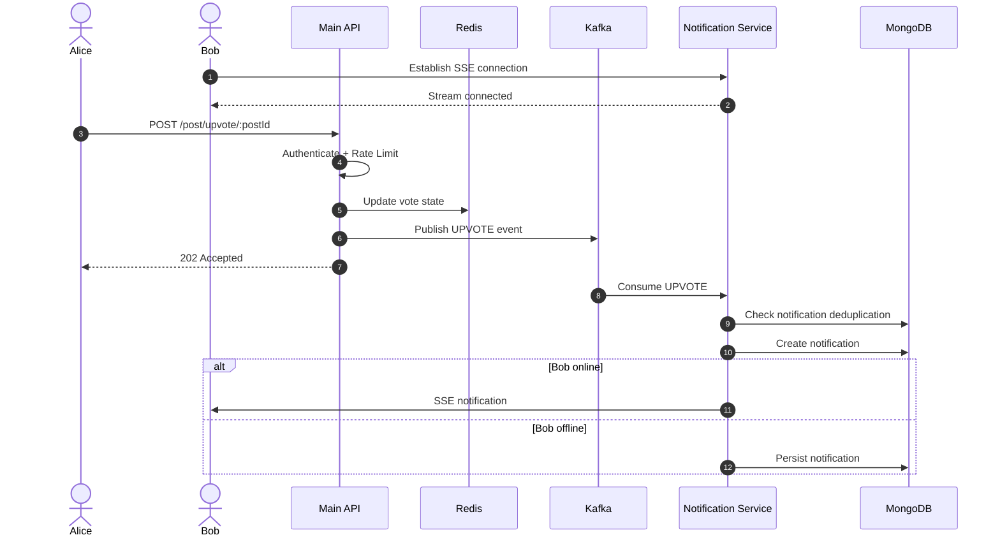

# LogicLab: Asynchronous Architecture & Event-Driven Systems Design

> **Central Engineering Narrative**
>
> LogicLab is a technical developer platform designed to reduce synchronous bottlenecks in sandboxed code execution and high-frequency user interactions by separating **request ingestion** from **background execution and event processing**. The architecture uses **Bull/Redis for asynchronous code execution, Apache Kafka for event-driven social workflows, and a dedicated SSE-based notification service for real-time delivery**.


---

# 1. What is LogicLab?

LogicLab combines an **online coding judge** with a **developer-focused social platform**.

Traditional coding platforms primarily focus on algorithmic problem solving, while general-purpose developer communities focus on discussion and networking. LogicLab combines these workflows into a single platform.

### Core capabilities

1. **Algorithmic Problem Evaluation**
   * Users solve programming problems in C++, Java, and JavaScript.
   * Solutions can be executed against visible test cases.
   * Formal submissions are evaluated against hidden test cases through Judge0.

2. **Contextual AI Assistance**
   * An integrated Gemini-based assistant analyzes the problem description and the user's active code.
   * It provides contextual hints and optimization guidance without intentionally returning complete solutions.

3. **Developer Activity Feed**
   * Users can create technical posts, upload images, interact through upvotes/downvotes, create threaded comments, and receive real-time notifications.

4. **Asynchronous Processing**
   * Expensive code execution is removed from the synchronous HTTP request path.
   * Social activity is decoupled through Kafka events.
   * Real-time notification delivery is isolated into a separate service using Server-Sent Events.

The primary engineering objective is to keep the **client-facing API responsive** even when expensive external processing or high-frequency user activity occurs.

---

# 2. Why is LogicLab Interesting?

## The Core Engineering Challenge

LogicLab combines two workloads with very different runtime characteristics.

```text
+-------------------------------------------------------------------------------+
|                         WORKLOAD PROFILE DIVERGENCE                           |
+-------------------------------------------------------------------------------+
| 1. COMPUTE-HEAVY / LONG-LIVED                | 2. HIGH-FREQUENCY I/O            |
|-----------------------------------------------|----------------------------------|
| - Code compilation and execution             | - Upvotes / downvotes            |
| - Hidden test-case evaluation                 | - Comments / replies             |
| - External Judge0 API calls                   | - Feed reads                     |
| - Multi-test-case processing                  | - Real-time notifications        |
| - Execution latency measured in seconds      | - Rapid state updates            |
+-------------------------------------------------------------------------------+
```

A naive synchronous submission architecture follows this flow:

```text
Client
   |
   v
Main API
   |
   v
Judge0
   |
   |  Wait for execution
   v
Result
   |
   v
HTTP Response
```

The major problem is that the API request remains open while the external code-execution workflow is being processed.

For a submission taking several seconds, the HTTP request is therefore alive for several seconds before the client receives the final verdict.

During the baseline benchmark, the submission endpoint achieved only approximately:

```text
0.2 requests/sec
```

with approximately:

```text
4,748 ms
```

of HTTP request duration.

The problem was not that Judge0 itself suddenly became slower or faster. The problem was that the **submission request remained coupled to the execution lifecycle**.

This coupling also affected the responsiveness of unrelated API traffic under concurrent submission load.

---

# 3. Architectural Solution

LogicLab separates the system into two stages:

```text
REQUEST INGESTION
        |
        v
ASYNC JOB / EVENT
        |
        +----------------------+
        |                      |
        v                      v
CODE EXECUTION             FEED PROCESSING
Bull / Redis               Kafka
        |                      |
        v                      v
Submission Worker        Feed / Notification Consumers
        |                      |
        v                      v
Judge0                    MongoDB + SSE
```

### 1. Asynchronous Code Execution

Instead of waiting for Judge0 inside the HTTP request:

```text
Client
   |
   v
API
   |
   v
Bull / Redis
   |
   +----> HTTP 202 Accepted
   |
   v
Background Worker (Concurrency: 5)
   |
   v
Judge0

```

The API performs lightweight request validation and job creation, then immediately acknowledges the request with:

```http
202 Accepted
```

The actual compilation and hidden-test execution continue asynchronously inside a background worker.

### 2. Event-Driven Feed Processing

High-frequency social actions are published as Kafka events.

```text
Client
   |
   v
Main API
   |
   v
Kafka
   |
   +-----------------------------+
   |                             |
   v                             v
Feed Consumer             Notification Consumer
   |                             |
   v                             v
MongoDB                    Notification + SSE
```

This decouples downstream processing from the original HTTP request lifecycle.

### 3. Dedicated Notification Service

The real-time notification layer is separated from the primary API.

```text
Kafka
   |
   v
Notification Service
   |
   v
SSE Connection
   |
   v
Browser
```

This keeps long-lived notification connections isolated from the core REST API.

---

# 4. High-Level Architecture

```text
                                  +----------------------+
                                  |    React / Vite      |
                                  |      Frontend        |
                                  +----------+-----------+
                                             |
                           +-----------------+------------------+
                           |                                    |
                           | REST / HTTP                         | SSE
                           v                                    v
              +---------------------------+       +---------------------------+
              |       Main API            |       |   Notification Service    |
              |       Port 3000           |       |       Port 3001           |
              +------------+--------------+       +-------------+-------------+
                           |                                    ^
                           |                                    |
                  +--------+---------+                          |
                  |                  |                          |
                  |                  |                          |
                  v                  v                          |
          +---------------+    +---------------+                 |
          | Bull Queue /  |    | Apache Kafka  |-----------------+
          | Redis Queue   |    | feed-events   |
          +-------+-------+    +-------+-------+
                  |                     |
                  v                     |
          +---------------+             |
          | Submission    |             |
          | Worker (x5)   |             |
          +-------+-------+             |
                  |                     |
                  v                     v
             +---------+         +-------------+
             | Judge0  |         |  Feed       |
             | Sandbox |         | Consumer    |
             +---------+         +------+------+
                                        |
                                        v
                                 +-------------+
                                 | MongoDB     |
                                 | Atlas       |
                                 +-------------+
```

---

# 5. Component Responsibilities

## Main API

The primary API handles:
* Authentication & JWT token validation
* Authorization & role-based checks
* Input validation & sanitization
* Atomic Redis token-bucket rate limiting
* Problem CRUD & scan-based cache invalidation
* Profile management
* Asynchronous submission ingestion & SSE result streaming
* Social-event ingestion (Kafka producer with partition keying)
* API response generation

Routes that require expensive background work enqueue or publish work rather than waiting for the final result.

---

## Bull + Redis

Bull is used specifically for **background code-execution jobs**.

Responsibilities include:
* Persistent Redis-backed queue management
* Deterministic job IDs & payload hash deduplication
* Retry handling with exponential backoff
* Worker concurrency bounding (`SUBMISSION_WORKER_CONCURRENCY`, default 5)
* Job lifecycle state publishing via Redis Pub/Sub

---

## Apache Kafka

Kafka is used for **event-driven feed processing**.

Kafka is appropriate here because the same social event can be consumed independently by multiple consumers.

For example:

```text
UPVOTE
   |
   +--> Feed Consumer (feed-processing-group)
   |
   +--> Notification Consumer (notification-processing-group)
```

Each consumer maintains its own processing position through its consumer group.

---

## Notification Service

The notification service:
* Consumes Kafka events independently
* Creates durable notification documents with compound deduplication
* Maintains SSE connections with per-user limits and comment heartbeats
* Pushes notifications to online users
* Persists notifications for offline users

---

## MongoDB

MongoDB stores:
* Users (with atomic problem-solving updates)
* Problems & reference solutions
* Submissions & test case execution verdicts
* Posts & comment trees
* Notifications with compound unique indices

MongoDB's document structure also fits naturally with:
* language-specific starter code
* nested test cases
* nested comment relationships
* flexible profile fields

---

## Redis

Redis is used for multiple purposes:
* Bull queue infrastructure
* Atomic Lua rate limiting
* JWT token revocation blocklist
* Feed caching
* Atomic Lua vote & score management
* Submission result caching & Pub/Sub SSE streaming
* Temporary asynchronous state

---

# 6. Core User Flow: Asynchronous Code Submission

```mermaid
sequenceDiagram
    autonumber

    actor User
    participant React as React Frontend
    participant API as Main API
    participant Redis as Redis / Bull Queue
    participant Worker as Submission Worker
    participant Judge0 as Judge0
    participant DB as MongoDB

    User->>React: Click Submit
    React->>API: POST /submission/submit/:id

    API->>API: Validate JWT
    API->>API: Atomic Lua Rate Limit
    API->>Redis: Check Idempotency Key & Payload Hash

    alt In-flight submission (Case 2)
        API-->>React: 202 Accepted (pending)
    alt Completed result (Case 3)
        API-->>React: 200 OK (cached verdict)
    alt Conflicting payload on same key (Case 6)
        API-->>React: 409 Conflict
    else New submission (Case 1)
        API->>Redis: Add Bull Job
        API-->>React: 202 Accepted + tracking ID
    end


    Worker->>Redis: Dequeue Job
    Worker->>DB: Fetch hidden test cases
    Worker->>Judge0: Submit batch
    Worker->>Judge0: Poll execution status

    Judge0-->>Worker: Execution results

    Worker->>Worker: Aggregate verdict/runtime/memory
    Worker->>DB: Persist submission result
    Worker->>Redis: Cache final result

    loop Result polling
        React->>API: GET /submission/status/:id
        API->>Redis: Check result

        alt Finished
            Redis-->>API: Final result
            API-->>React: 200 OK
        else Pending
            API-->>React: 202 Accepted
        end
    end
```

---

# 7. Why the Asynchronous Design Matters

The most important architectural change is:

### Before

```text
HTTP Request
     |
     v
Judge0
     |
     |---- wait 2–5 seconds ----|
     |
     v
HTTP Response
```

### After

```text
HTTP Request
     |
     v
Create Job
     |
     v
202 Accepted
```

Meanwhile:

```text
Bull Worker (Concurrency: 5)
     |
     v
Judge0
     |
     v
Store Result
```


Therefore, the API no longer has to wait for the entire code-execution workflow before acknowledging the request.

This improves the **responsiveness and throughput of the ingestion endpoint**, while the actual execution still occurs in the background.

---

# 8. Event-Driven Social Flow



---

# 9. Technology Stack & Rationale

| Technology     | Purpose                          | Why it was chosen                                                                           |
| -------------- | -------------------------------- | ------------------------------------------------------------------------------------------- |
| **MongoDB**    | Application persistence          | Flexible document structure for coding problems, test cases, profiles, posts and comments   |
| **Redis**      | Queue/state/cache infrastructure | Low-latency counters, temporary state, token revocation, caching and Bull backing           |
| **Bull**       | Background jobs                  | Persistent asynchronous execution with retries, job IDs and worker concurrency              |
| **Kafka**      | Event streaming                  | Allows multiple independent consumers to process the same event stream                      |
| **SSE**        | Real-time notifications          | Notifications are primarily server-to-client, making unidirectional HTTP streaming suitable |
| **Judge0**     | Code execution                   | Provides sandboxed execution for multiple programming languages                             |
| **Gemini**     | Coding assistance                | Generates contextual hints using the problem and active code                                |
| **Cloudinary** | Media storage                    | Keeps images outside the database and provides optimized media delivery                     |
| **JWT**        | Authentication                   | Cryptographically verifiable authentication tokens                                          |
| **Express**    | HTTP API                         | Routing, middleware composition and REST API implementation                                 |

---

# 10. Key Engineering Decision #1

## Synchronous Judge0 vs. Asynchronous Bull Queue

### Problem

The initial design executed the Judge0 workflow directly inside the submission request path.

The measured baseline was approximately:

```text
Throughput: 0.2 RPS
Latency:    4,748 ms
```

### Decision

Move submission processing into Bull queue backed by Redis.

### New flow

```text
POST /submission/submit/:id
          |
          v
      Validation
          |
          v
       Bull Job
          |
          v
    202 Accepted
```

Worker:

```text
Bull Queue
  |
  v
Submission Worker (Concurrency: 5)
  |
  v
Judge0
  |
  v
MongoDB / Redis (Pub/Sub SSE Stream)
```

### Trade-off

The client no longer receives the final verdict in the initial HTTP response.

It retrieves the result via Server-Sent Events or polling:

```text
GET /submission/stream/:idempotencyKey  (SSE Stream)
GET /submission/status/:id              (Fallback Polling)
```

Polling / streaming is therefore a deliberate trade-off for decoupling execution from request ingestion.

---

# 11. Key Engineering Decision #2

## Bull vs. In-Memory Queue

An in-memory queue would lose pending jobs if the process crashed or restarted.

Bull provides:
* Redis-backed persistence
* Job identifiers & hash deduplication
* Retry support
* Exponential backoff
* Job state management
* Worker concurrency limits (`SUBMISSION_WORKER_CONCURRENCY`)
* Cleanup policies

### Trade-off

Redis becomes an additional infrastructure dependency and job lifecycle management becomes necessary.

---

# 12. Key Engineering Decision #3

## Kafka vs. Bull for Social Events

Bull and Kafka serve different roles.

### Bull

Best suited for point-to-point job execution with worker concurrency limits:

```text
One job
   |
   +--> One worker from competing workers
```

### Kafka

Better suited when an event is broadcast to multiple consumer groups:


```text
One event
   |
   +--> Feed Consumer
   |
   +--> Notification Consumer
   |
   +--> Future Analytics Consumer
```

Kafka provides a persistent event stream where multiple consumer groups can independently process the same events.

That makes Kafka a better fit for the social event pipeline.

### Trade-off

Kafka introduces:
* broker management
* topic configuration
* consumer groups
* partitioning decisions
* TLS configuration
* additional operational complexity

---

# 13. Key Engineering Decision #4

## SSE vs. WebSockets vs. Polling

The notification system primarily needs:

```text
Server ---> Client
```

rather than:

```text
Server <--> Client
```

Therefore SSE is appropriate.

### Advantages
* Uses standard HTTP
* Native browser EventSource support
* Automatic reconnect behavior
* Unidirectional communication
* Simple implementation for notification streams

### Trade-off

SSE does not provide bidirectional communication.

Client-to-server actions still use normal REST requests.

For code submission results, the current implementation uses polling rather than SSE.

---

# 14. Key Engineering Decision #5

## MongoDB vs. SQL

MongoDB was selected because several data structures are naturally document-oriented:

```text
Problem
 ├── starterCode
 ├── languages
 ├── visibleTests
 └── hiddenTests
```

and:

```text
User
 ├── work
 ├── education
 └── skills
```

The system also contains nested comment relationships and evolving profile fields.

### Trade-off

The application needs to carefully manage consistency across collections rather than relying primarily on relational joins and database-level relational constraints.

---

# 15. Key Engineering Decision #6

## JWT + Redis Revocation vs. Server-Side Sessions

JWTs provide cryptographically verifiable authentication without requiring a traditional session lookup for token verification.

However, standard JWTs cannot be revoked before expiration.

LogicLab therefore combines:

```text
JWT
 +
Redis blacklist
```

On logout:

```text
JWT
 |
v
Redis token blacklist
 |
v
TTL until token expiration
```

This provides immediate token invalidation while keeping token verification stateless.

---

# 16. Key Engineering Decision #7

## Optimistic UI and Backend-Generated ObjectIds

When social actions are processed asynchronously, the frontend still needs a stable identifier immediately.

The API therefore generates a MongoDB-compatible ObjectId before publishing the event.

```text
API
 |
 +--> Generate ObjectId
 |
 +--> Publish event with ObjectId
 |
 +--> Return 202 + ObjectId
```

The consumer later persists the same ID.

This allows the frontend to immediately reference the eventual database entity.

### Trade-off

If the asynchronous consumer permanently fails, the frontend can temporarily hold an object identifier that has not been persisted.

---

# 17. Key Engineering Decision #8

## Dedicated Notification Microservice

SSE connections are long-lived.

Keeping these connections on the primary API would mix:

```text
Short-lived REST requests
+
Long-lived streaming connections
```

A separate Notification Service isolates:
* Kafka consumption
* SSE connection state
* heartbeat management
* notification persistence
* real-time delivery

This means notification traffic can scale independently from authentication, coding and problem-solving APIs.

---

# 18. Request and Data Flow

## Synchronous REST Path

```text
Client
  |
  v
Express Router
  |
  v
JWT Middleware
  |
  v
Redis Blacklist Check
  |
  v
Rate Limiter
  |
  v
Controller
  |
  v
MongoDB
  |
  v
HTTP Response
```

Used primarily for operations such as:
* authentication
* profiles
* problem CRUD
* standard database reads

---

## Asynchronous Path

```text
Client
  |
  v
Ingestion Endpoint
  |
  +--> Validation
  |
  +--> Idempotency
  |
  +--> Queue / Kafka
  |
  v
202 Accepted
```

Then:

```text
               +-----------------------+
               |                       |
               v                       v
          Bull Queue / Redis      Kafka ("feed-events")
               |                       |
               v                       +----------------------+
       Submission Worker (x5)          |                      |
               |                       v                      v
               v                 Feed Consumer       Notification Consumer
             Judge0                    |                      |
               |                       v                      v
               v                   MongoDB                 SSE
             MongoDB
               |
               v
             Redis (Pub/Sub Stream)
```

---

# 19. Asynchronous Job Processing

The submission queue is configured around:

```text
Queue:
submissions

Worker concurrency:
5 (Configurable via SUBMISSION_WORKER_CONCURRENCY)

Retries:
3

Backoff:
Exponential

Initial backoff:
2 seconds

Result cache:
1 hour TTL
```

### Job lifecycle

### Step 1 — Enqueue

The API receives:

```text
code
language
problemId
idempotencyKey
```

The idempotency key is also used as the Bull job identifier with SHA-256 payload collision verification.


---

### Step 2 — Worker execution

The worker:
1. Fetches hidden test cases.
2. Builds the Judge0 batch payload.
3. Submits the batch.
4. Polls execution tokens.
5. Aggregates verdict, runtime and memory.
6. Stores the submission record.
7. Updates the user's solved-problem state when appropriate.
8. Caches the result in Redis.

---

### Step 3 — Result retrieval

The frontend requests:

```text
GET /submission/status/:id
```

### Pending

```json
{
  "status": "pending"
}
```

### Completed

```json
{
  "status": "accepted",
  "runtime": "...",
  "memory": "..."
}
```

---

# 20. Kafka Event Pipeline

Kafka topic:

```text
feed-events
```

Consumer groups:

```text
feed-processing-group
notification-processing-group
```

### Events

| Event            | Producer         | Feed Consumer                   | Notification Consumer |
| ---------------- | ---------------- | ------------------------------- | --------------------- |
| `POST_CREATED`   | Post creation    | Persist post + invalidate cache | Ignore                |
| `UPVOTE`         | Post vote        | Update vote state/count         | Create notification   |
| `DOWNVOTE`       | Post vote        | Update vote state/count         | Ignore                |
| `COMMENT`        | Comment creation | Persist comment                 | Create notification   |
| `UPVOTE_COMMENT` | Comment vote     | Update vote state/count         | Create notification   |

---

# 21. Real-Time Notification System

The Notification Service exposes:

```text
GET /notifications/stream
```

The connection uses:

```text
Content-Type: text/event-stream
Connection: keep-alive
Cache-Control: no-cache
```

The service maintains active connections in memory:

```text
Map<userId, Set<Response>>
```

A heartbeat is periodically sent:

```text
:\n\n
```

This keeps the connection active.

When a client disconnects:

```text
req.on("close")
```

the corresponding connection is removed.

---

# 22. Notification Deduplication

A notification consumer checks whether an equivalent unread notification already exists.

Conceptually:

```javascript
Notification.findOne({
    recipient,
    sender,
    type,
    postReference,
    isRead: false
});
```

If an equivalent unread notification already exists, a duplicate notification is avoided.

This prevents repeated interactions from unnecessarily filling the recipient's notification list.

---

# 23. Code Execution Architecture

LogicLab supports:

```text
JavaScript
C++
Java
```

Judge0 is used as the execution environment.

There are two execution modes:

### Run Code

```text
Visible test cases
```

Used for quick experimentation.

### Submit Code

```text
Hidden test cases
        |
        v
Bull Queue
        |
        v
Submission Worker (Concurrency: 5)
        |
        v
Judge0
```


The worker aggregates:
* execution status
* runtime
* memory
* test cases passed

---

# 24. Authentication Flow

```text
Client
  |
  v
HTTP-only Cookie
  |
  v
JWT Verification
  |
  v
Redis Blacklist Check
  |
  v
User Lookup
  |
  v
Authenticated Request
```

### Security properties

Authentication cookies use:

```text
HttpOnly
Secure
SameSite
```

where appropriate for the deployment environment.

Logout places the token into Redis with a TTL aligned to the token's remaining lifetime and clears the client cookie.

Passwords are protected using bcrypt hashing.

---

# 25. Rate Limiting

Rate limiting is implemented using Redis.

Two approaches are used:

### Fixed Window

```text
INCR
+
EXPIRE
```

### Sliding Window

Redis sorted sets are used to track submission timestamps over the relevant time window.

---

# 26. Route Rate Limits

| Route                         | Limit | Window |
| ----------------------------- | ----: | -----: |
| `POST /user/login`            |    25 | 60 sec |
| `POST /submission/submit/:id` |     5 | 60 sec |
| `POST /submission/run/:id`    |    10 | 60 sec |
| `POST /post/create`           |    10 |   1 hr |
| `POST /post/upvote/:id`       |   100 | 60 sec |
| `POST /comment/:postId`       |    30 | 60 sec |

The submission endpoint has particularly strict limits because code execution consumes external resources.

---

# 27. Database Design

## User
Stores:
* authentication information
* profile metadata
* work history
* education history
* skills
* solved problem references

## Problem
Stores:
* title
* difficulty
* tags
* starter code
* visible test cases
* hidden test cases

## Submission
Stores:
* user reference
* problem reference
* source code
* language
* execution state
* runtime
* memory
* passed-test count

## Post
Stores:
* content
* tags
* media references
* vote information
* aggregate counts

## Comment
Stores:
* author
* post reference
* parent comment reference
* content
* vote information

## Notification
Stores:
* recipient
* sender information
* notification type
* post/comment reference
* read status

---

# 28. Indexing Strategy

Important indexes include:

```text
Post.createdAt: -1
Comment.post: 1
Comment.parentComment: 1
Submission.userId: 1, problemId: 1
Notification.recipient: 1, createdAt: -1
```

These support common access patterns such as:
* chronological feeds
* post comment retrieval
* nested replies
* submission history
* notification inbox queries

---

# 29. Concurrency and Idempotency

High-frequency interactions require careful handling of duplicate requests and race conditions.

For votes, Redis state and MongoDB atomic operators are used.

Examples include:

```text
$addToSet
$pull
INCRBY
```

The purpose is to avoid classic:

```text
read
  |
modify
  |
write
```

race conditions where concurrent requests overwrite each other's updates.

---

# 30. Failure Handling

| Component  | Failure                     | Behavior                                                              |
| ---------- | --------------------------- | --------------------------------------------------------------------- |
| Judge0     | Timeout / temporary failure | Circuit breaker fast-fails on open; Bull retries exponential backoff  |
| Gemini AI  | Rate limit / 503 outage     | Circuit breaker trips; fails fast preventing API thread starvation    |
| Redis      | Connection failure          | Rate limiting fails open; queue-dependent operations return errors    |
| Kafka      | Connectivity failure        | Producer reports failure; consumer reconnects                         |
| SSE Client | Disconnect                  | Connection is removed; EventSource reconnects with comments keepalive |
| MongoDB    | Query/connection failure    | Express error handling returns an appropriate failure response        |

The system prioritizes **graceful failure over process crashes**.

---

# 31. Performance Testing

Performance testing was conducted using:

```text
autocannon
```

The primary benchmark was specifically designed to measure the effect of moving Judge0 processing out of the synchronous request path.

## Before

```text
Client
  |
  v
Main API
  |
  v
Judge0
  |
  |---- approximately 4.7 seconds ----|
  |
  v
HTTP Response
```

Measured submission endpoint:

```text
0.2 RPS
4,748 ms latency
```

---

## After

```text
Client
  |
  v
Main API
  |
  v
Bull Queue
  |
  v
202 Accepted

Background:

Bull Queue
  |
  v
Submission Worker (Concurrency: 5)
  |
  v
Judge0
  |
  v
MongoDB / Redis (Pub/Sub SSE Stream)
```

Measured submission ingestion:

```text
56.4 RPS
175.93 ms latency
```

The throughput ratio is approximately:

```text
56.4 / 0.2 = 282x
```

Therefore:

> **The asynchronous ingestion path achieved approximately 282× the measured throughput of the synchronous baseline.**

This should be interpreted as an **API ingestion-throughput improvement**, not as Judge0 execution becoming 282× faster.

The sandboxed compilation and test execution still occur in the background and continue to take several seconds depending on workload.

---

# 32. Baseline Performance Comparison

| Scenario            | Pre RPS | Post RPS |  Pre Latency |  Post Latency |
| ------------------- | ------: | -------: | -----------: | ------------: |
| Health Check        | 3,111.5 |  1,404.9 |      2.73 ms |       6.64 ms |
| Get Profile         |    11.6 |     31.0 |    793.23 ms |     316.81 ms |
| Public Profile      |    11.2 |     60.2 |    857.33 ms |     162.54 ms |
| **Code Submission** | **0.2** | **56.4** | **4,748 ms** | **175.93 ms** |
| AI Chat             |     3.6 |     12.2 |    538.78 ms |     162.62 ms |
| Problem Create      |    54.4 |     55.5 |    180.65 ms |     174.43 ms |

The largest architectural improvement is clearly visible in the submission endpoint because that endpoint was directly affected by the transition from synchronous Judge0 processing to asynchronous queue-based processing.

---

# 33. High-Concurrency Test

A separate benchmark simulated a burst of approximately 1,000 concurrent connections.

| Scenario         | Concurrency |   RPS | Avg. Latency |
| ---------------- | ----------: | ----: | -----------: |
| Health Check     |       1,000 | 862.5 |  1,527.36 ms |
| Public Profile   |       1,000 | 649.3 |  1,725.85 ms |
| Async Submission |       1,000 | 569.0 |  1,658.97 ms |
| AI Chat          |       1,000 | 806.6 |  1,428.64 ms |

These results should be interpreted as **synthetic load-test results in the benchmark environment**, not as a claim that the system can support 1,000 production users with identical behavior.

---

# 34. Security Considerations

## Untrusted Code

User code is delegated to the Judge0 sandbox rather than executed directly inside the primary application process.

## Session Security

Authentication tokens are transported using secure HTTP-only cookies.

## Kafka Security

Kafka communication uses TLS credentials configured through environment variables.

## Password Security

Passwords are hashed with bcrypt before storage.

## Input Validation

Controllers validate:
* required fields
* types
* string values
* MongoDB ObjectIds
* request structure

---

# 35. Testing Strategy

The repository contains dedicated testing and benchmark utilities.

### Load Testing

```text
Day01/load-test.js
```

Used for:
* endpoint benchmarking
* concurrent request simulation
* performance comparisons

### Resilience & Architecture Unit Tests

```text
Day01/test/resilience.test.js
```

Run via `npm test` inside `Day01` to test:
* Circuit breaker state transitions (`CLOSED` -> `OPEN` -> `HALF_OPEN` -> `CLOSED`)
* Idempotency & SHA-256 payload conflict detection
* Atomic Redis Lua vote state transitions & score arithmetic
* Validator resilience against malformed inputs
* Kafka event envelope integrity & partition keying
* SSE comment heartbeat formatting

### Event Pipeline Testing

```text
NotificationService/test-publish.js
```

Used to:
* publish Kafka test events
* validate consumer behavior
* exercise the notification pipeline
* test SSE delivery

---

# 36. Project Structure & Local Setup

```text
LogicLab/
│
├── Day01/                           # Primary Backend REST API & Bull Workers (Port 3000)
│   ├── src/
│   │   ├── config/                  # DB, Redis & Kafka connection setups
│   │   ├── controllers/             # Express route controllers
│   │   ├── middleware/              # userMiddleware, adminMiddleware, rateLimiter
│   │   ├── models/                  # Mongoose Schemas (User, Problem, Submission, Post, Comment)
│   │   ├── routes/                  # Express Router definitions
│   │   ├── utilities/               # Cloudinary upload, Judge0 helper, CircuitBreaker, validator
│   │   └── workers/                 # Background workers (submissionQueue.js, feedConsumer.js)
│   └── test/
│       └── resilience.test.js       # Automated resilience test suite

│   └── load-test.js                 # Autocannon load testing script
│
├── NotificationService/             # Real-Time SSE Notification Microservice (Port 3001)
│   ├── src/
│   │   ├── config/                  # Kafka & MongoDB configs
│   │   ├── controllers/             # notificationController.js (SSE stream registry & CRUD)
│   │   ├── middleware/              # Auth middleware for SSE stream verification
│   │   ├── models/                  # Notification Mongoose schema
│   │   ├── routes/                  # Notification router endpoints
│   │   └── workers/                 # notificationConsumer.js (Kafka event subscriber)
│   └── test-publish.js              # Standalone Kafka test producer script
│
└── Day02/vite-project/              # Frontend React Client (Port 5173)
    └── src/
        ├── components/              # PostCard, CommentSection, ChatAi, CodeEditor, Navbar
        ├── context/                 # NotificationContext (SSE stream manager & toasts)
        ├── pages/                   # Homepage, Problempage, FeedLab, AdminInfo, Profile
        └── store/                   # Redux store & authSlice
```

### Local Development Setup

```bash
# 1. Start Primary REST API & Workers
cd Day01
npm install
npm run dev

# 2. Start Notification Microservice
cd ../NotificationService
npm install
npm run dev

# 3. Start Frontend Client
cd ../Day02/vite-project
npm install
npm run dev
```

---

# 37. Complete Feature Set

## Authentication & Profiles
* JWT authentication
* HTTP-only cookie transport
* Redis-backed token revocation
* User profiles
* Work and education history
* Public profile pages

## Online Judge
* C++
* Java
* JavaScript
* Visible test execution
* Hidden test submission
* Runtime measurement
* Memory measurement
* Submission history
* Admin problem verification

## AI Assistant
* Problem-aware prompts
* Active code context
* Algorithmic hints
* Optimization suggestions

## FeedLab
* Developer posts
* Image uploads
* Upvotes
* Downvotes
* Threaded comments
* Comment voting
* Optimistic updates
* Real-time notifications

## Admin
* Problem creation
* Problem editing
* Test-case management
* Reference-solution verification
* Problem publishing

---

# 38. Current Limitations

The architecture intentionally contains several limitations.

### 1. Submission result polling
The code submission API is asynchronous, but the frontend currently retrieves completion state using HTTP polling.

### 2. In-memory SSE connection registry
The Notification Service keeps active SSE connections in memory. With multiple notification-service instances, a distributed connection/pub-sub mechanism would be required.

### 3. Shared MongoDB cluster
The primary API and Notification Service currently use the same MongoDB cluster. This simplifies development but does not provide strict database isolation between services.

### 4. Kafka partitioning
The current `feed-events` configuration uses a single partition. This limits parallelism within a consumer group.

These limitations are explicitly identified because they represent the next scaling boundaries rather than being hidden.

---

# 39. Future Improvements

## 1. Push-based submission results
Replace polling with:
```text
SSE
or
WebSockets
```
for job completion notifications.

## 2. Distributed notification delivery
Introduce:
```text
Kafka
   |
   v
Notification Consumer
   |
   v
Redis Pub/Sub
   |
   v
Multiple SSE Instances
```
This would allow the notification service to scale horizontally.

## 3. Service-level database isolation
Move the Notification Service toward its own database boundary to strengthen microservice ownership and reduce shared-resource contention.

## 4. Kafka Partitioning
Increase Kafka topic partitions and select an appropriate partition key such as:
```text
recipientId
```
or:
```text
postId
```
This would allow greater consumer parallelism while preserving relevant ordering.

## 5. Circuit Breakers
Add circuit breakers around external services such as:
```text
Judge0
Gemini
```
to prevent degraded upstream providers from consuming excessive application resources.

---

# 40. Engineering Summary

The most important architectural transformation in LogicLab is the transition from:

```text
Synchronous Request
        |
        v
Expensive External Processing
        |
        v
Final HTTP Response
```

to:

```text
Fast Request Ingestion
        |
        v
Queue / Event
        |
        +----------------------+
        |                      |
        v                      v
Background Worker        Event Consumers
        |                      |
        v                      v
Judge0                  MongoDB / SSE
```

This architecture allows the system to separate:

```text
REQUEST RESPONSIVENESS
```

from:

```text
BACKGROUND PROCESSING
```

The resulting benchmark showed the code-submission ingestion endpoint improving from:

```text
0.2 RPS
```

to:

```text
56.4 RPS
```

or approximately:

```text
282× higher measured throughput
```

while reducing API acknowledgement latency from:

```text
4,748 ms
```

to:

```text
175.93 ms
```

The key point is that this improvement comes from **decoupling the API request lifecycle from Judge0 execution**, not from making the external code-execution engine itself faster.

That asynchronous design, combined with Kafka-based event processing and a dedicated SSE notification service, forms the central system-design story of LogicLab.
