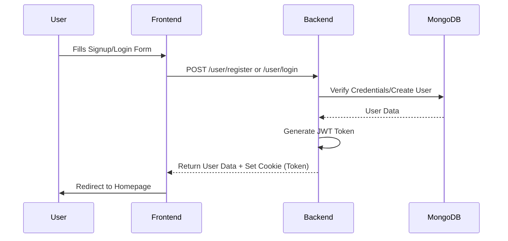
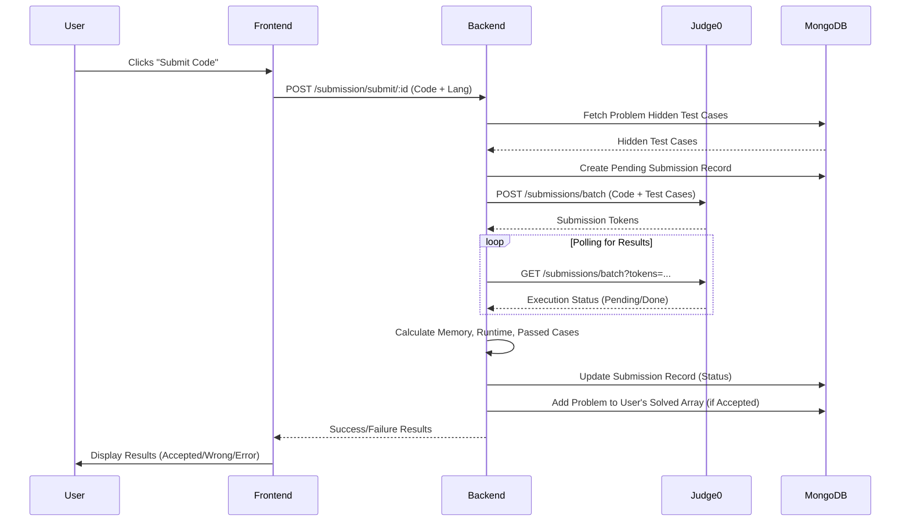
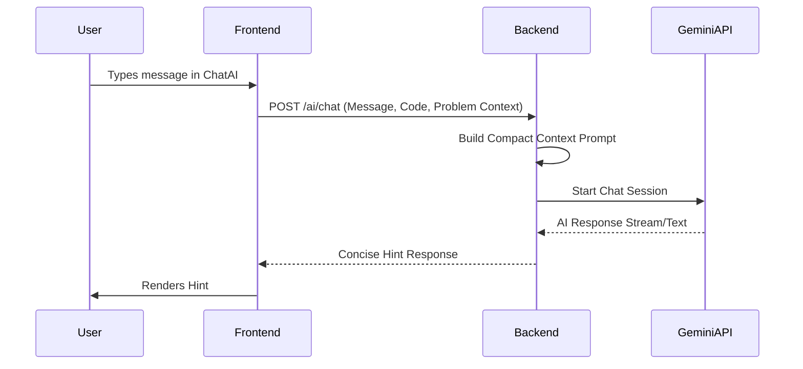

# LogicLab 🚀

A comprehensive problem-solving platform where users can practice Data Structures and Algorithms (DSA) alongside a completely integrated social developer feed (FeedLab). Features range from basic code execution to an AI-powered hint system.

Built with **React + Vite** on the frontend, and **Node.js + Express + MongoDB** on the backend. Code execution is powered by **Judge0**, the AI assistant leverages **Google Gemini 1.5**, and Rate Limiting is structurally enforced via **Redis**.

---

## 🌟 Key Features

### 1. User Authentication & Authorization
- **JWT-Based Authentication**: Secure session management using HTTP-only cookies (`SameSite=none`, `secure=true` for cross-origin support).
- **Role-Based Access Control**:
  - `user`: Can view problems, submit code, use the AI assistant, and track their progress.
  - `admin`: Full access to the Admin Panel to Create, Update, and Delete problems.
- **Advanced Profile Management**: 
  - Update Personal Info: Name, Nickname (@handle), Age, Gender, Location, and Birthday.
  - **Dynamic Experience Tracking**: Add multiple Work and Education entries dynamically.
  - **Social Integration**: Link GitHub, LinkedIn, and personal portfolios.
  - **Skills Tagging**: Manage a professional skill set with comma-separated tags.
  - **Media**: Upload and manage profile pictures via Cloudinary.

### 2. Code Execution Engine (Judge0)
- Supports **C++, Java, and JavaScript**.
- Two modes of execution:
  1. **Run Code**: Tests against the *visible* test cases to provide immediate feedback to the user.
  2. **Submit Code**: Tests against the *hidden* test cases to formally grade the submission.
- **Detailed Submission Insights**: Individual submission page detailing runtime (s), memory (MB), language, test cases passed, and a syntax-highlighted source code playback.

### 3. AI Coding Assistant (Gemini)
- Integrated Chatbot specifically contextualized to the problem the user is viewing.
- Analyzes the problem description, visible test cases, and the *user's current code in the editor*.
- Provides concise, targeted hints without giving away the direct solution.

### 4. Problem Tracking & Analytics
- Users can view their **Submission History** for any specific problem.
- **Submission Detail Page**: Deep dive into any past submission to review the code and performance metrics.
- Real-time updates on problems solved (marked with a checkmark on the Homepage).
- Problem filtering by Difficulty (Easy, Medium, Hard), Tags (Array, Graph, DP, etc.), and Status (Solved/Unsolved).

### 5. FeedLab (Social Interfacing) & Cloudinary
- A robust developer timeline where users can post logic, debugging problems, images, or snippets. Includes **infinite scrolling API pagination**.
- **Social Interactions**: Users can **Upvote**, **Downvote**, and **Bookmark** posts to save them for later.
- **Rich Posting**: Supports **Emoji Picker** integration and high-res **Cloudinary Media Uploads**.
- **Immersive Viewing**: Click any post image to trigger a **Fullscreen Cinematic Overlay**.
- **Commenting System**: Fully integrated threaded comments. Users can add, delete (if author), and upvote comments on any post.
- **Profiles**: Navigating to any coder's public profile populates a beautiful 3x3 `.aspect-square` grid detailing their past posts. Clicking a post triggers a dual-pane cinematic floating modal identical to Instagram Web layout displaying visuals and captions.

### 6. Premium UI & Security Architecture
- **NProgress Routing**: Integrated dynamic top-bar neon loading indicators completely intercepting Axios routes—eliminating chaotic spinning UI wheels.
- **Native App Feel**: Executed global CSS purges destroying unsightly OS-native scrollbars while locking scroll-wheel physics flawlessly.
- **Redis Rate Limiting**: The Judge0 code execution engines are rigorously locked behind a Redis-based *Sliding Window Rate Limiter* (50 requests/hour/user), securely throwing 429 warnings to block automated spamming attempts logic.

### 7. Enhanced Admin Panel & Dashboard
- **Admin Overview**: A dedicated dashboard (`AdminInfo`) for admins to track their own solving progress, badges (e.g., Code Ninja), and quick access to management tools.
- **Create Problem**: Define titles, rich descriptions, difficulty, tags, starter code, and test cases.
- **Verify Solutions**: Before a problem goes live, the admin's reference solution is automatically validated against all provided test cases to ensure correctness.
- **Modify/Delete**: Complete CRUD capabilities for problem management.

---

## 🗺️ Architecture Flowcharts

### Authentication Flow


### Problem Submission Flow


### AI Assistant Flow


---

## 🗂️ Project Structure

### Backend (`/Day01`)
- **`/src/controllers`**: 
  - `aiController.js`: Manages the Gemini API interactions.
  - `userAuthenticate.js`: Login, register, logout, profile update logic, and specific public profiling.
  - `userComment.js`: Logic for creating, deleting, and upvoting comments on FeedLab posts.
  - `userProblems.js`: Admin CRUD operations for problems + User fetching.
  - `userPost.js`: Engine executing FeedLab social interactions (posts, upvotes, bookmarks), sorting, and aggregating posts globally or by user.
  - `userSubmission.js`: Logic for routing code to Judge0 for "Run" and "Submit", wrapped in rate limiting middleware.
- **`/src/models`**: Mongoose schemas (`user.js`, `problems.js`, `submission.js`, `post.js`, `comment.js`).
- **`/src/routes`**: Express routing bridging endpoints to controllers.
- **`/src/utilities`**: Database connections, Redis architecture, Validators, Cloudinary upload workflows, and Judge0 configurations.

### Frontend (`/Day02/vite-project`)
- **`/src/pages`**: Main application views:
  - `Homepage.jsx`: Dashboard and problem list.
  - `FeedLab.jsx`: Social timeline with infinite scroll.
  - `Admininfo.jsx`: Modern admin dashboard with quick actions.
  - `SubmissionDetail.jsx`: Detailed view of code submissions.
  - `UpdateProfile.jsx`: Profile editing with Cloudinary integration.
- **`/src/components`**: Reusable elements like `ChatAi`, `SubmissionHistory`, and `PostCard`.
- **`/src/store`**: Redux state management (primarily `authSlice` to track logged-in users).
- **`/src/utility`**: Core utilities like `axios.js` configured with the backend Base URL and `withCredentials: true`.

---

## 🛠️ Tech Stack Setup & Local Development

### Prerequisites
- Node.js (v16+)
- MongoDB Atlas URI or Local MongoDB
- Redis (For token invalidation blocklist & Rate Limiting)
- Cloudinary Account (For image & profile uploads)
- Judge0 API Key (via RapidAPI)
- Gemini API Key

### Installation

1. Clone the repository and navigate into both folders separately.
2. Install dependencies:
   ```bash
   # In Day01 (Backend)
   cd Day01
   npm install
   
   # In Day02/vite-project (Frontend)
   cd ../Day02/vite-project
   npm install
   ```

3. Setup environment variables (`.env`) in the Backend directory (`Day01/.env`):
   ```env
   PORT=3000
   MONGO_URI=your_mongodb_connection_string
   JWT_KEY=your_secret_jwt_key
   GEM_secrete=your_gemini_api_key
   CLOUDINARY_API_KEY=your_key
   CLOUDINARY_API_SECRET=your_secret
   CLOUDINARY_CLOUD_NAME=your_name
   REDIS_URL=your_redis_url
   ```

4. Start both servers:
   ```bash
   # Terminal 1: Backend
   cd Day01
   npm run dev
   # Terminal 2: Frontend
   cd Day02/vite-project
   npm run dev
   ```

