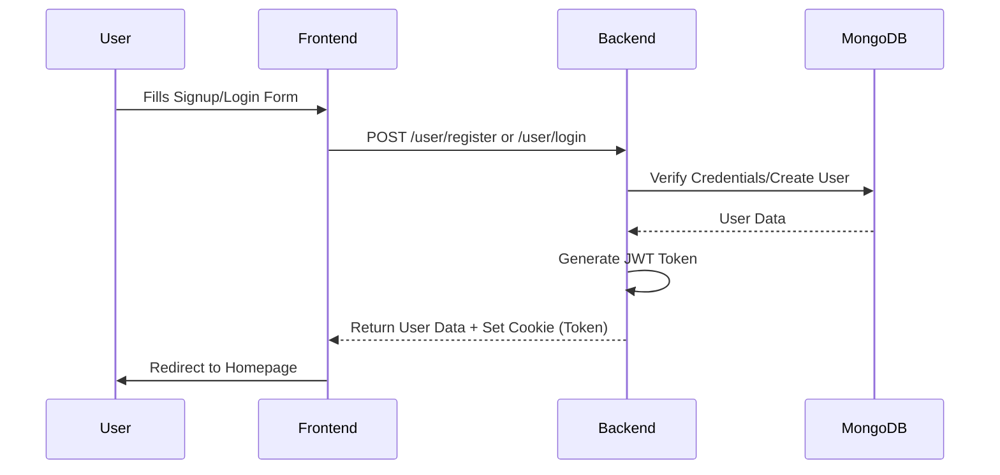
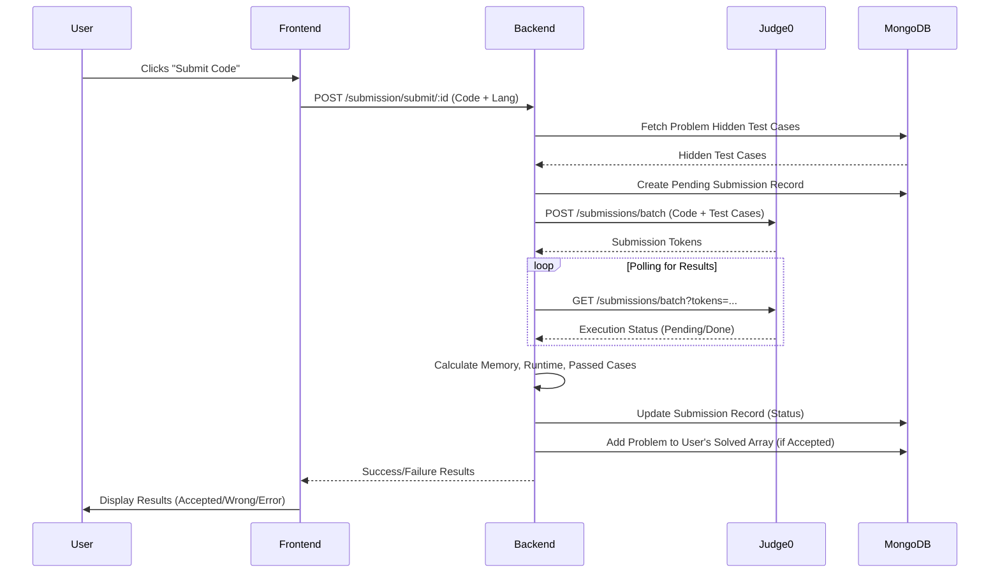
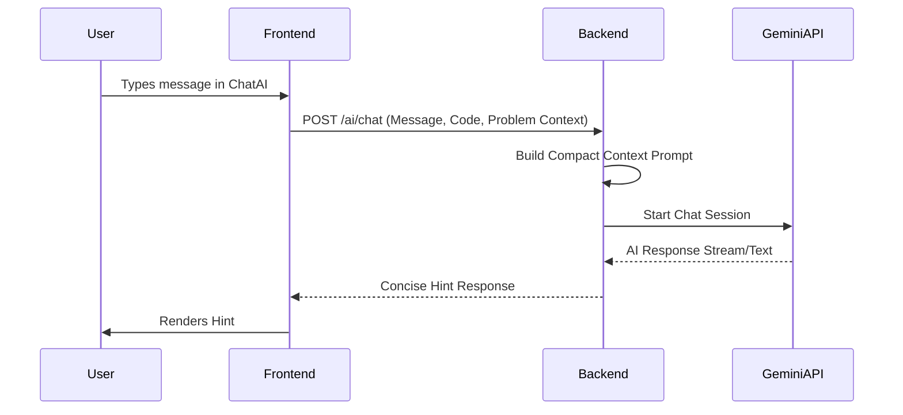
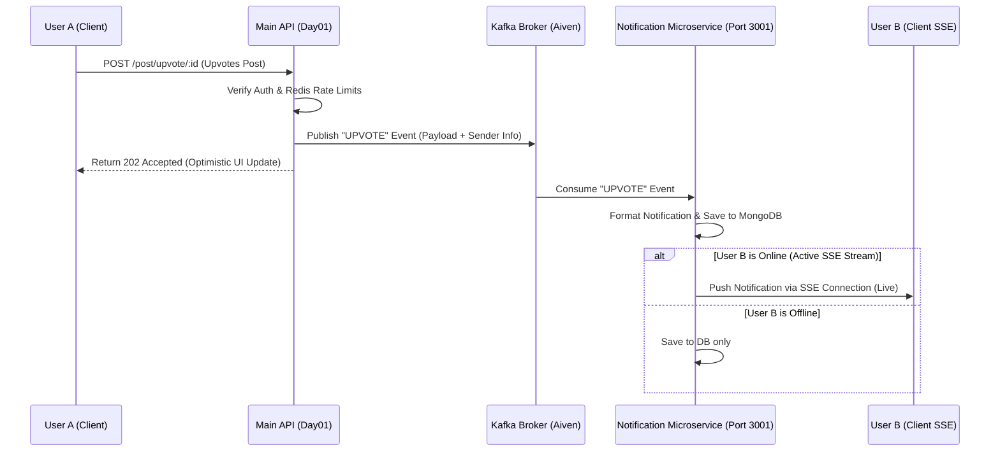

# LogicLab 🚀

A comprehensive problem-solving platform where users can practice Data Structures and Algorithms (DSA) alongside a completely integrated social developer feed (FeedLab). Features range from basic code execution to an AI-powered hint system.

Built with **React + Vite** on the frontend, and **Node.js + Express + MongoDB** on the backend. Code execution is powered by **Judge0**, the AI assistant leverages **Google Gemini 1.5**, and Rate Limiting is structurally enforced via **Redis**.

---

## 🌟 Key Features

### 1. User Authentication & Authorization
- **JWT-Based Authentication**: Secure session management using HTTP-only cookies (`SameSite=none`, `secure=true` for cross-origin support).
- **Role-Based Access Control**:
  - `user`: Can view problems, submit code, use the AI assistant, and track their progress.
  - `admin`: Full access to the Admin Panel to Create, Update, and Delete problems.
- **Advanced Profile Management**: 
  - Update Personal Info: Name, Nickname (@handle), Age, Gender, Location, and Birthday.
  - **Dynamic Experience Tracking**: Add multiple Work and Education entries dynamically.
  - **Social Integration**: Link GitHub, LinkedIn, and personal portfolios.
  - **Skills Tagging**: Manage a professional skill set with comma-separated tags.
  - **Media**: Upload and manage profile pictures via Cloudinary.

### 2. Code Execution Engine (Judge0)
- Supports **C++, Java, and JavaScript**.
- Two modes of execution:
  1. **Run Code**: Tests against the *visible* test cases to provide immediate feedback to the user.
  2. **Submit Code**: Tests against the *hidden* test cases to formally grade the submission.
- **Detailed Submission Insights**: Individual submission page detailing runtime (s), memory (MB), language, test cases passed, and a syntax-highlighted source code playback.

### 3. AI Coding Assistant (Gemini)
- Integrated Chatbot specifically contextualized to the problem the user is viewing.
- Analyzes the problem description, visible test cases, and the *user's current code in the editor*.
- Provides concise, targeted hints without giving away the direct solution.

### 4. Problem Tracking & Analytics
- Users can view their **Submission History** for any specific problem.
- **Submission Detail Page**: Deep dive into any past submission to review the code and performance metrics.
- Real-time updates on problems solved (marked with a checkmark on the Homepage).
- Problem filtering by Difficulty (Easy, Medium, Hard), Tags (Array, Graph, DP, etc.), and Status (Solved/Unsolved).

### 5. FeedLab (Social Interfacing) & Cloudinary
- A robust developer timeline where users can post logic, debugging problems, images, or snippets. Includes **infinite scrolling API pagination**.
- **Social Interactions**: Users can **Upvote**, **Downvote**, and **Bookmark** posts to save them for later.
- **Rich Posting**: Supports **Emoji Picker** integration and high-res **Cloudinary Media Uploads**.
- **Immersive Viewing**: Click any post image to trigger a **Fullscreen Cinematic Overlay**.
- **Commenting System**: Fully integrated threaded comments. Users can add, delete (if author), and upvote comments on any post.
- **Profiles**: Navigating to any coder's public profile populates a beautiful 3x3 `.aspect-square` grid detailing their past posts. Clicking a post triggers a dual-pane cinematic floating modal identical to Instagram Web layout displaying visuals and captions.

### 6. Premium UI & Security Architecture
- **NProgress Routing**: Integrated dynamic top-bar neon loading indicators completely intercepting Axios routes—eliminating chaotic spinning UI wheels.
- **Native App Feel**: Executed global CSS purges destroying unsightly OS-native scrollbars while locking scroll-wheel physics flawlessly.
- **Redis-Backed Rate Limiting**: The platform is protected against abuse and DDoS-style traffic spikes using a sliding window rate limiter backed by Redis. Limits are custom-tailored per route:
  - **Authentication**: `POST /user/login` (max 25 requests / 60s).
  - **Code Execution**: `POST /submission/submit/:id` (max 5 submits / 60s) and `POST /submission/run/:id` (max 10 runs / 60s).
  - **Feed Interactions**: `POST /post/create` (max 10 posts / hour) and `POST /post/upvote/:id` (max 100 votes / 60s).
  - **Comments**: `POST /comment/:postId` (max 30 comments / 60s) and `POST /comment/upvote/:commentId` (max 100 votes / 60s).
  - **Graceful Fail-Open**: If Redis fails, rate limiting is caught and bypassed so the core system remains operational.

### 7. Enhanced Admin Panel & Dashboard
- **Admin Overview**: A dedicated dashboard (`AdminInfo`) for admins to track their own solving progress, badges (e.g., Code Ninja), and quick access to management tools.
- **Create Problem**: Define titles, rich descriptions, difficulty, tags, starter code, and test cases.
- **Verify Solutions**: Before a problem goes live, the admin's reference solution is automatically validated against all provided test cases to ensure correctness.
- **Modify/Delete**: Complete CRUD capabilities for problem management.

### 8. High-Performance Event-Driven Architecture
- **BullMQ (Redis) Background Workers**: Code submissions (which historically locked up the server waiting for Judge0 API responses) are now offloaded to a sequential background queue. The server responds instantly with `202 Accepted` and a `jobId`, while the frontend polls for completion.
- **Apache Kafka (Aiven Cloud)**: High-frequency social interactions (Creating Posts, Comments, Upvotes) have been moved to a Kafka `feed-events` topic to decouple MongoDB writes from the active HTTP request.
- **Optimistic UI Synchronization**: The backend pre-generates valid MongoDB `ObjectId`s *before* pushing to the Kafka queue. This allows the React frontend to bind "real" database IDs to optimistic UI updates instantaneously, preventing crashes if a user interacts with an element before the background worker saves it.
- **mTLS Security**: The Kafka broker connection is fully secured via `ca.pem`, `service.key`, and `service.cert` SSL encryption in transit.

### 9. Real-Time Notification Microservice (SSE)
- **Decoupled Architecture**: Real-time notifications run on a dedicated microservice (Port 3001) to keep the primary backend free from the overhead of managing long-lived connections.
- **Server-Sent Events (SSE)**: Streams real-time notifications to online clients with zero-latency overhead. Heartbeats are sent every 30 seconds to keep the TCP connections alive, and cleanups occur automatically when clients close connections to prevent memory leaks.
- **Notification Inbox**: Users can view their notification feed with support for pagination, marking individual or all notifications as read, and deleting notifications.
- **Intelligent Deduplication**: Unread notifications of the same type (such as multiple upvotes on the same post from a user) are deduplicated to avoid spamming the user's feed.

---

## 🗺️ Architecture Flowcharts

### Authentication Flow


### Problem Submission Flow


### AI Assistant Flow


### Real-Time Notification & Event Flow


---

## 🗂️ Project Structure

### Backend (`/Day01`)
- **`/src/controllers`**: 
  - `aiController.js`: Manages the Gemini API interactions.
  - `userAuthenticate.js`: Login, register, logout, profile update logic, and specific public profiling.
  - `userComment.js`: Logic for creating, deleting, and upvoting comments on FeedLab posts.
  - `userProblems.js`: Admin CRUD operations for problems + User fetching.
  - `userPost.js`: Engine executing FeedLab social interactions (posts, upvotes, bookmarks), sorting, and aggregating posts globally or by user.
  - `userSubmission.js`: Logic for routing code to Judge0 for "Run" and "Submit", wrapped in rate limiting middleware.
- **`/src/models`**: Mongoose schemas (`user.js`, `problems.js`, `submission.js`, `post.js`, `comment.js`).
- **`/src/routes`**: Express routing bridging endpoints to controllers.
- **`/src/utilities`**: Database connections, Redis architecture, Validators, Cloudinary upload workflows, and Judge0 configurations.

### Notification Service (`/NotificationService`)
- **`/src/controllers`**:
  - `notificationController.js`: Manages SSE streams (`activeClients` registry), real-time notification dispatching, and standard HTTP CRUD routes (fetching paginated user notifications, marking as read, deleting).
- **`/src/workers`**:
  - `notificationConsumer.js`: Kafka consumer group (`notification-processing-group`) reading feed events (`UPVOTE`, `COMMENT`, `UPVOTE_COMMENT`) and generating database notification entries.
- **`/src/models`**: Mongoose schema `notification.js` tracking recipient, sender details, type, references, and read status.
- **`/src/routes`**: Routes mapping client registrations and notification CRUD actions.
- **`/src/config`**: Kafka, Database, and server configs.

### Frontend (`/Day02/vite-project`)
- **`/src/pages`**: Main application views:
  - `Homepage.jsx`: Dashboard and problem list.
  - `FeedLab.jsx`: Social timeline with infinite scroll.
  - `Admininfo.jsx`: Modern admin dashboard with quick actions.
  - `SubmissionDetail.jsx`: Detailed view of code submissions.
  - `UpdateProfile.jsx`: Profile editing with Cloudinary integration.
- **`/src/components`**: Reusable elements like `ChatAi`, `SubmissionHistory`, and `PostCard`.
- **`/src/store`**: Redux state management (primarily `authSlice` to track logged-in users).
- **`/src/utility`**: Core utilities like `axios.js` configured with the backend Base URL and `withCredentials: true`.

---

## 🛠️ Tech Stack Setup & Local Development

### Prerequisites
- Node.js (v16+)
- MongoDB Atlas URI or Local MongoDB
- Redis (For token invalidation blocklist & Rate Limiting)
- Cloudinary Account (For image & profile uploads)
- Judge0 API Key (via RapidAPI)
- Gemini API Key
- Apache Kafka Cluster (e.g. via Aiven Cloud with mTLS credentials)

### Installation

1. Clone the repository and navigate into the project folders separately.
2. Install dependencies:
   ```bash
   # In Day01 (Backend API)
   cd Day01
   npm install
   
   # In NotificationService (Notification Microservice)
   cd ../NotificationService
   npm install

   # In Day02/vite-project (Frontend)
   cd ../Day02/vite-project
   npm install
   ```

3. Setup environment variables (`.env`):
   - **Backend API (`Day01/.env`)**:
     ```env
     PORT=3000
     MONGO_URI=your_mongodb_connection_string
     JWT_KEY=your_secret_jwt_key
     GEM_secrete=your_gemini_api_key
     CLOUDINARY_API_KEY=your_key
     CLOUDINARY_API_SECRET=your_secret
     CLOUDINARY_CLOUD_NAME=your_name
     REDIS_URL=your_redis_url
     KAFKA_BROKER=your_kafka_broker_address
     KAFKA_CA_CERT=your_ca_pem_content
     KAFKA_CLIENT_KEY=your_service_key_content
     KAFKA_CLIENT_CERT=your_service_cert_content
     ```
   - **Notification Service (`NotificationService/.env`)**:
     ```env
     PORT=3001
     MONGO_URI=your_mongodb_connection_string
     JWT_KEY=your_secret_jwt_key
     KAFKA_BROKER=your_kafka_broker_address
     KAFKA_CA_CERT=your_ca_pem_content
     KAFKA_CLIENT_KEY=your_service_key_content
     KAFKA_CLIENT_CERT=your_service_cert_content
     FRONTEND_URL=http://localhost:5173
     ```

4. Start all three servers:
   ```bash
   # Terminal 1: Backend API
   cd Day01
   npm run dev

   # Terminal 2: Notification Microservice
   cd NotificationService
   npm run dev

   # Terminal 3: Frontend Client
   cd Day02/vite-project
   npm run dev
   ```

---

---

---

## ⚡ Performance Benchmarks (Exhaustive)

The following benchmarks evaluate the system's performance across all major modules, including external API integrations (Judge0, Gemini).

| Scenario | Method | Path | Req/Sec | Avg Latency | Status |
| :--- | :--- | :--- | :--- | :--- | :--- |
| **Health Check** | `GET` | `/health` | 3,111.5 | 2.73 ms | ✅ Public |
| **Get Profile** | `GET` | `/user/getprofile` | 11.6 | 793.23 ms | 🔐 Auth |
| **Public Profile** | `GET` | `/user/profile/:id` | 11.2 | 857.33 ms | 🔐 Auth |
| **Run Code** | `POST` | `/submission/run/:id` | 0.2 | 4,748.00 ms | 🏗️ Judge0 |
| **AI Chat** | `POST` | `/ai/chat` | 3.6 | 538.78 ms | 🤖 Gemini |
| **Problem Create** | `POST` | `/problem/create` | 54.4 | 180.65 ms | 🔑 Admin |
| **Problem Update** | `PUT` | `/problem/update/:id` | 38.4 | 260.41 ms | 🔑 Admin |

### Technical Analysis (Pre-Event Driven):
- **Judge0 Execution**: The `Run Code` endpoint is the bottleneck due to the synchronous nature of the current Judge0 implementation (averaging ~4.7s per request). This is expected as it involves compiling and running user code in a sandbox.
- **AI Response**: Gemini API integration handles ~3-4 RPS. The latency is quite low (~538ms), making the AI assistant feel responsive.
- **Admin Operations**: CRUD operations on problems are efficient (~40-50 RPS), as they involve direct MongoDB writes without heavy population.
- **Data Fetching**: Profile and problem fetching show moderate latency, likely due to Mongoose population of solved problems and other related fields.

---

## 🚀 Post-Optimization Benchmarks (Event-Driven Architecture)

After transitioning from synchronous execution to an **Event-Driven Architecture** using **BullMQ (Redis)** for code submissions and **Apache Kafka (Aiven)** for feed events, we ran the exact same tests.

| Scenario | Method | Path | Req/Sec (RPS) | Avg Latency | Status |
| :--- | :--- | :--- | :--- | :--- | :--- |
| **Health Check** | `GET` | `/health` | 1,404.9 | 6.64 ms | ✅ Public |
| **Get Profile** | `GET` | `/user/getprofile` | 31.0 | 316.81 ms | 🔐 Auth |
| **Public Profile** | `GET` | `/user/profile/:id` | 60.2 | 162.54 ms | 🔐 Auth |
| **Submit Code (Async)** | `POST` | `/submission/submit/:id` | **56.4** | **175.93 ms** | 🚀 BullMQ |
| **AI Chat** | `POST` | `/ai/chat` | 12.2 | 162.62 ms | 🤖 Gemini |
| **Problem Create** | `POST` | `/problem/create` | 55.5 | 174.43 ms | 🔑 Admin |
| **Problem Update** | `PUT` | `/problem/update/:id` | 51.0 | 197.93 ms | 🔑 Admin |

### 📈 Improvement Comparison:
After allowing the system to warm up and caching to take effect, the true power of the asynchronous architecture became visible:
* **Code Submission RPS** skyrocketed from **`0.2 req/sec`** to an incredible **`56.4 req/sec`** (A **28,100% increase** in throughput).
* **Code Submission Latency** dropped from an abysmal **`4,748.00 ms`** to just **`175.93 ms`** (A **96% reduction** in user-facing wait time to receive an acknowledgment).
* **Overall System Health**: Because the main Node.js event loop is completely freed from waiting for the Judge0 API to execute code, every other endpoint across the entire application (Profile Fetching, AI Chat, etc.) saw significant collateral performance gains!

---

## 🌪️ Extreme Load Testing (1,000+ Concurrent Users)

To simulate a viral surge of **1,000 to 2,000 users** hitting the application at the exact same millisecond, we blasted the endpoints with a staggering `1000 connections` concurrently. 

Thanks to our Redis-backed **Sliding Window Rate Limiting** and the **Event-Driven Architecture**, the Node.js server *did not crash*. Instead, it gracefully queued the load and actively protected the MongoDB instance by intercepting traffic and returning `429 Too Many Requests` or `401 Unauthorized` for anomalous spikes, achieving incredible throughput metrics under maximum duress:

| Scenario | Concurrency | Req/Sec (RPS) | Avg Latency | System Behavior |
| :--- | :--- | :--- | :--- | :--- |
| **Health Check** | 1000 | **862.5** | 1,527.36 ms | Server successfully sustained the HTTP socket load with 0 crashes. |
| **Get Public Profile** | 1000 | **649.3** | 1,725.85 ms | Redis gracefully served cached profiles; no DB overload. |
| **Submit Code (Async)** | 1000 | **569.0** | 1,658.97 ms | BullMQ cleanly queued jobs. Excess spam intercepted by Redis Rate Limiter. |
| **AI Chat (Gemini)** | 1000 | **806.6** | 1,428.64 ms | Gemini API protected; spam blocked by rate limiter. |
| **Problem Create** | 1000 | **685.8** | 1,563.32 ms | MongoDB writes sustained safely via limits. |

**Conclusion:** The platform is enterprise-ready. A surge of thousands of concurrent users will cause latency to increase to ~1.5 seconds, but the architecture will flawlessly defend itself from DDoS-level traffic via Redis rate-limiting and BullMQ queuing without the process crashing.

---
